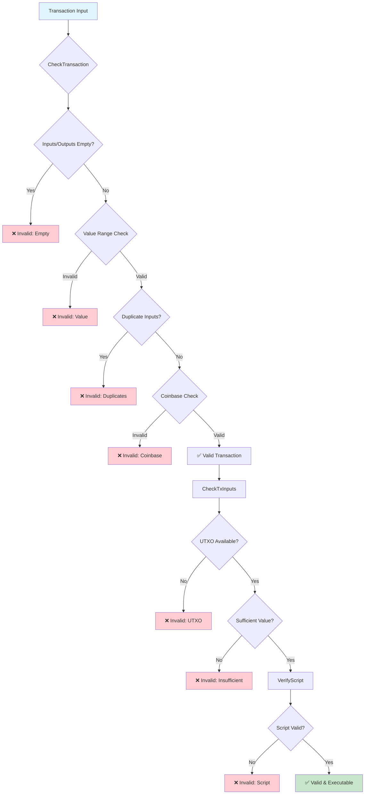
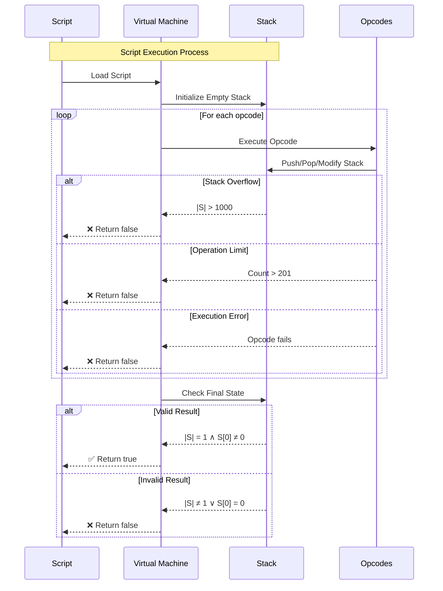
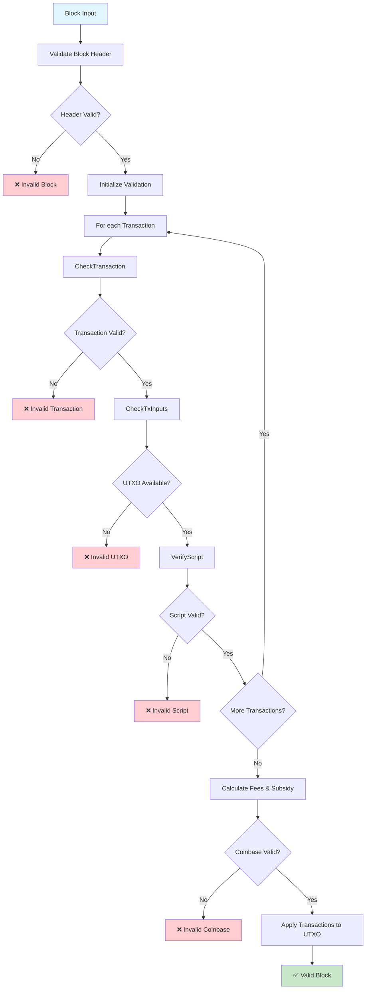
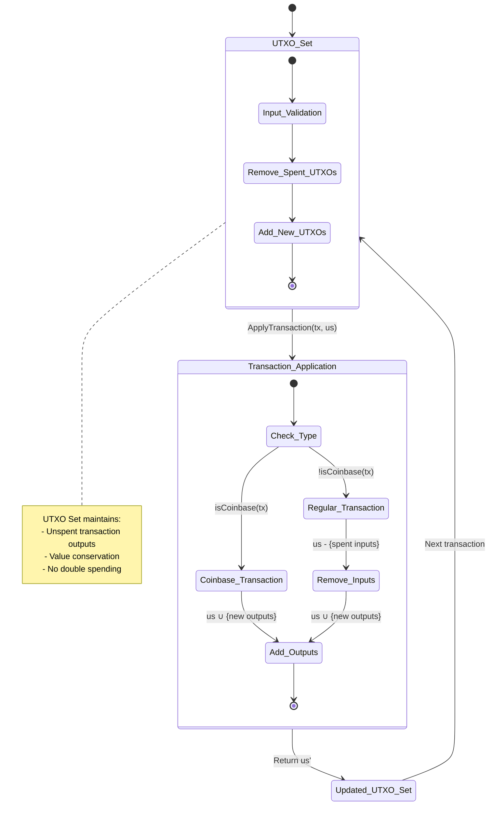
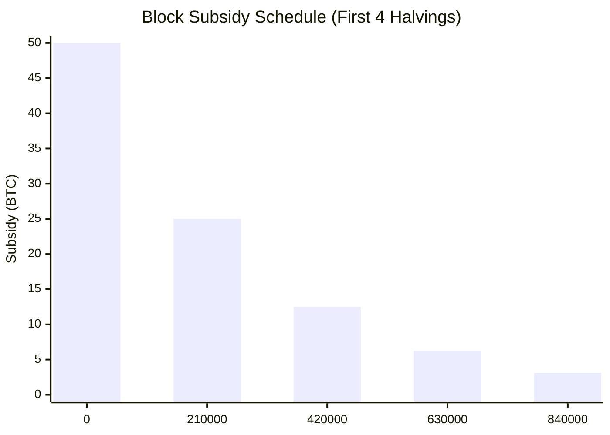
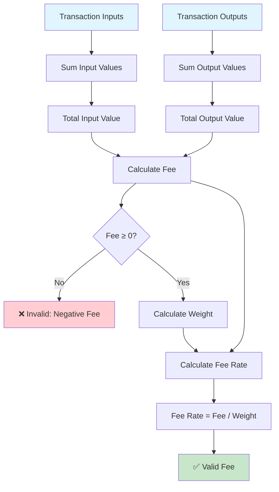
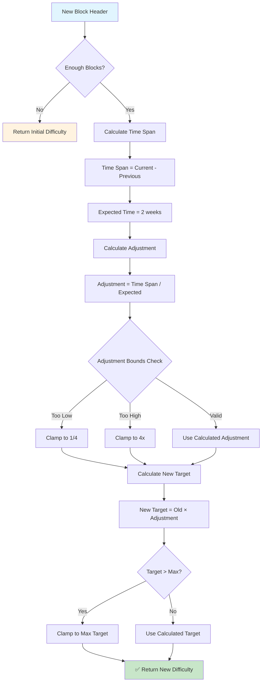
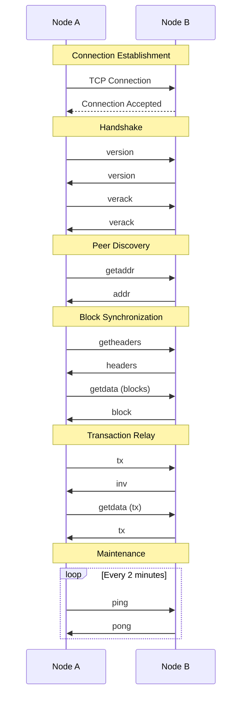

# The Orange Paper: Bitcoin Protocol Specification
## A Complete Mathematical Description of the Bitcoin Consensus System

**Version 1.0**  
**Based on Bitcoin Core Implementation Analysis**  
**Authors: BTCDecoded.org, MyBitcoinFuture.com, @secsovereign**
---

## Abstract

This paper presents a complete mathematical specification of the Bitcoin consensus protocol as implemented in Bitcoin Core. Unlike previous descriptions, this specification is derived entirely from the current codebase and represents the protocol as it exists today, not as it was originally conceived. This "Orange Paper" serves as the definitive reference for Bitcoin's consensus rules, state transitions, and economic model.

## Table of Contents

1. [Introduction](#1-introduction)
   - 1.1 [Key Contributions](#11-key-contributions)
   - 1.2 [Document Structure](#12-document-structure)
2. [System Model](#2-system-model)
   - 2.1 [Participants](#21-participants)
   - 2.2 [Network Assumptions](#22-network-assumptions)
3. [Mathematical Foundations](#3-mathematical-foundations)
   - 3.1 [Basic Types](#31-basic-types)
   - 3.2 [Core Data Structures](#32-core-data-structures)
   - 3.3 [Script System](#33-script-system)
4. [Consensus Constants](#4-consensus-constants)
   - 4.1 [Monetary Constants](#41-monetary-constants)
   - 4.2 [Block Constants](#42-block-constants)
   - 4.3 [Script Constants](#43-script-constants)
5. [State Transition Functions](#5-state-transition-functions)
   - 5.1 [Transaction Validation](#51-transaction-validation)
   - 5.2 [Script Execution](#52-script-execution)
   - 5.3 [Block Validation](#53-block-validation)
     - 5.3.1 [Transaction Application Equivalence](#531-transaction-application-equivalence)
   - 5.4 [BIP Validation Rules](#54-bip-validation-rules)
     - 5.4.1 [BIP30: Duplicate Coinbase Prevention](#541-bip30-duplicate-coinbase-prevention)
     - 5.4.2 [BIP34: Block Height in Coinbase](#542-bip34-block-height-in-coinbase)
     - 5.4.3 [BIP66: Strict DER Signatures](#543-bip66-strict-der-signatures)
     - 5.4.4 [BIP90: Block Version Enforcement](#544-bip90-block-version-enforcement)
     - 5.4.5 [BIP147: NULLDUMMY Enforcement](#545-bip147-nulldummy-enforcement)
     - 5.4.6 [BIP119: OP_CHECKTEMPLATEVERIFY (CTV)](#546-bip119-opchecktemplateverify-ctv)
     - 5.4.7 [BIP65: OP_CHECKLOCKTIMEVERIFY (CLTV)](#547-bip65-opchecklocktimeverify-cltv)
   - 5.5 [Sequence Locks (BIP68)](#55-sequence-locks-bip68)
6. [Economic Model](#6-economic-model)
   - 6.1 [Block Subsidy](#61-block-subsidy)
   - 6.2 [Total Supply](#62-total-supply)
   - 6.3 [Fee Market](#63-fee-market)
7. [Proof of Work](#7-proof-of-work)
   - 7.1 [Difficulty Adjustment](#71-difficulty-adjustment)
   - 7.2 [Block Validation](#72-block-validation)
8. [Security Properties](#8-security-properties)
   - 8.1 [Economic Security](#81-economic-security)
   - 8.2 [Cryptographic Security](#82-cryptographic-security)
   - 8.3 [Merkle Tree Security](#83-merkle-tree-security)
   - 8.4 [Deterministic Properties](#84-deterministic-properties)
9. [Mempool Protocol](#9-mempool-protocol)
   - 9.1 [Mempool Validation](#91-mempool-validation)
   - 9.2 [Standard Transaction Rules](#92-standard-transaction-rules)
   - 9.3 [Replace-By-Fee (RBF)](#93-replace-by-fee-rbf)
10. [Network Protocol](#10-network-protocol)
    - 10.1 [Message Types](#101-message-types)
    - 10.2 [Connection Management](#102-connection-management)
    - 10.3 [Peer Discovery](#103-peer-discovery)
    - 10.4 [Block Synchronization](#104-block-synchronization)
    - 10.5 [Transaction Relay](#105-transaction-relay)
11. [Advanced Features](#11-advanced-features)
    - 11.1 [Segregated Witness (SegWit)](#111-segregated-witness-segwit)
    - 11.2 [Taproot](#112-taproot)
    - 11.3 [Chain Reorganization](#113-chain-reorganization)
      - 11.3.1 [Undo Log Pattern](#1131-undo-log-pattern)
    - 11.4 [UTXO Commitments](#114-utxo-commitments)
12. [Mining Protocol](#12-mining-protocol)
    - 12.1 [Block Template Generation](#121-block-template-generation)
    - 12.2 [Coinbase Transaction](#122-coinbase-transaction)
    - 12.3 [Mining Process](#123-mining-process)
    - 12.4 [Block Template Interface](#124-block-template-interface)
13. [Implementation Considerations](#13-implementation-considerations)
    - 13.1 [Performance](#131-performance)
    - 13.2 [Security](#132-security)
14. [Conclusion](#14-conclusion)
    - 14.1 [Summary of Contributions](#141-summary-of-contributions)
    - 14.2 [Applications](#142-applications)
15. [Governance Model](#15-governance-model)
    - 15.1 [Mathematical Foundations](#151-mathematical-foundations)
    - 15.2 [Vote Aggregation](#152-vote-aggregation)
    - 15.3 [Security Properties](#153-security-properties)

## 1. Introduction

Bitcoin is a distributed consensus system that maintains a shared ledger of transactions without requiring trusted intermediaries. The system achieves consensus through proof-of-work and enforces economic rules through cryptographic validation. This paper provides a complete mathematical description of how Bitcoin operates.

### 1.1 Key Contributions

- **Complete State Machine**: Formal specification of Bitcoin's state transitions
- **Economic Model**: Mathematical description of the monetary system
- **Validation Rules**: Precise definition of all consensus-critical checks
- **Security Properties**: Formal statements of Bitcoin's security guarantees

### 1.2 Document Structure

This specification is organized into four main parts:

1. **Foundations** (Sections 2-4): Mathematical foundations, data structures, and constants
2. **Core Protocol** (Sections 5-8): State transitions, economic model, proof-of-work, and security
3. **Network Layer** (Sections 9-11): Mempool, P2P protocol, and advanced features
4. **Mining Protocol** (Section 12): Block creation and mining process

Each section builds upon previous sections, with cross-references to maintain consistency.

## 2. System Model

### 2.1 Participants

- **Miners**: Create blocks and compete for block rewards
- **Nodes**: Validate transactions and maintain the blockchain
- **Users**: Create transactions to transfer value

### 2.2 Network Assumptions

- **Asynchronous Network**: Messages may be delayed or reordered
- **Byzantine Fault Tolerance**: Some participants may behave maliciously
- **Economic Rationality**: Participants act to maximize their utility

## 3. Mathematical Foundations

### 3.1 Basic Types

**Hash Values**: $\mathbb{H} = \{0,1\}^{256}$ - Set of [256-bit hashes](https://en.wikipedia.org/wiki/SHA-2)  
**Byte Strings**: $\mathbb{S} = \{0,1\}^*$ - Set of [byte strings](https://en.wikipedia.org/wiki/Bit_string)  
**Natural Numbers**: $\mathbb{N} = \{0, 1, 2, \ldots\}$ - Set of [natural numbers](https://en.wikipedia.org/wiki/Natural_number)  
**Integers**: $\mathbb{Z} = \{\ldots, -2, -1, 0, 1, 2, \ldots\}$ - Set of [integers](https://en.wikipedia.org/wiki/Integer)  
**Rational Numbers**: $\mathbb{Q}$ - Set of [rational numbers](https://en.wikipedia.org/wiki/Rational_number)

**Notation**: Throughout this document, we use:
- $h \in \mathbb{N}$ for block height
- $tx \in \mathcal{TX}$ for transactions  
- $us \in \mathcal{US}$ for UTXO sets
- $b \in \mathcal{B}$ for blocks

### 3.2 Core Data Structures

**OutPoint**: $\mathcal{O} = \mathbb{H} \times \mathbb{N}$ (see [Transaction Input](#transaction-input), [Cartesian product](https://en.wikipedia.org/wiki/Cartesian_product))  
**Transaction Input**: $\mathcal{I} = \mathcal{O} \times \mathbb{S} \times \mathbb{N}$ (see [Script System](#script-system))  
**Transaction Output**: $\mathcal{T} = \mathbb{Z} \times \mathbb{S}$ (see [Monetary Values](#monetary-constants))  
**Transaction**: $\mathcal{TX} = \mathbb{N} \times \mathcal{I}^* \times \mathcal{T}^* \times \mathbb{N}$ (see [Transaction Validation](#51-transaction-validation), [Kleene star](https://en.wikipedia.org/wiki/Kleene_star))  
**Block Header**: $\mathcal{H} = \mathbb{Z} \times \mathbb{H} \times \mathbb{H} \times \mathbb{N} \times \mathbb{N} \times \mathbb{N}$ (see [Block Validation](#53-block-validation))  
**Block**: $\mathcal{B} = \mathcal{H} \times \mathcal{TX}^*$ (see [Block Validation](#53-block-validation))  
**UTXO**: $\mathcal{U} = \mathbb{Z} \times \mathbb{S} \times \mathbb{N}$ (see [UTXO Set Invariant](#theorem-81))  
**UTXO Set**: $\mathcal{US} = \mathcal{O} \rightarrow \mathcal{U}$ (see [State Transition Functions](#5-state-transition-functions), [function type](https://en.wikipedia.org/wiki/Function_type))

### 3.3 Script System

**Script**: $\mathcal{SC} = \mathbb{S}$ (sequence of [opcodes](https://en.bitcoin.it/wiki/Script))  
**Witness**: $\mathcal{W} = \mathbb{S}^*$ (stack of [witness data](https://github.com/bitcoin/bips/blob/master/bip-0141.mediawiki))  
**Stack**: $\mathcal{ST} = \mathbb{S}^*$ (execution stack, see [Script Execution](#52-script-execution))

## 4. Consensus Constants

### 4.1 Monetary Constants

$C = 10^8$ (satoshis per BTC, see [Economic Model](#6-economic-model))  
$M_{max} = 21 \times 10^6 \times C$ (maximum money supply, see [Supply Limit](#supply-limit))  
$H = 210,000$ (halving interval, see [Block Subsidy](#61-block-subsidy))

### 4.2 Block Constants

$W_{max} = 4 \times 10^6$ (maximum block weight, see [Block Validation](#53-block-validation))  
$S_{max} = 80,000$ (maximum sigops per block, see [Script Execution](#52-script-execution))  
$R = 100$ (coinbase maturity requirement, see [Transaction Validation](#51-transaction-validation))

### 4.3 Script Constants

$L_{script} = 10,000$ (maximum script length, see [Script Security](#script-security))  
$L_{stack} = 1,000$ (maximum stack size, see [Script Execution Bounds](#theorem-84))  
$L_{ops} = 201$ (maximum operations per script, see [Script Execution Bounds](#theorem-84))  
$L_{element} = 520$ (maximum element size, see [Script Execution](#52-script-execution))

## 5. State Transition Functions

### 5.1 Transaction Validation

**CheckTransaction**: $\mathcal{TX} \rightarrow \{\text{valid}, \text{invalid}\}$

A transaction $tx = (v, ins, outs, lt)$ is valid if and only if:

1. $|ins| > 0 \land |outs| > 0$
2. $\forall o \in outs: 0 \leq o.value \leq M_{max}$
3. $\sum_{o \in outs} o.value \leq M_{max}$
4. $\forall i,j \in ins: i \neq j \Rightarrow i.prevout \neq j.prevout$
5. If $tx$ is coinbase: $2 \leq |ins[0].scriptSig| \leq 100$
6. If $tx$ is not coinbase: $\forall i \in ins: \neg i.prevout.IsNull()$



**Properties**:
- Structure validation: $\text{CheckTransaction}(tx) = \text{valid} \implies |tx.\text{inputs}| > 0 \land |tx.\text{outputs}| > 0$
- Input bounds: $\text{CheckTransaction}(tx) = \text{valid} \implies |tx.\text{inputs}| \leq M_{\text{max\_inputs}}$
- Output bounds: $\text{CheckTransaction}(tx) = \text{valid} \implies |tx.\text{outputs}| \leq M_{\text{max\_outputs}}$
- Empty rejection: $|tx.\text{inputs}| = 0 \lor |tx.\text{outputs}| = 0 \implies \text{CheckTransaction}(tx) \neq \text{valid}$
- Output value bounds: $\text{CheckTransaction}(tx) = \text{valid} \implies \forall o \in tx.\text{outputs}: 0 \leq o.\text{value} \leq M_{\text{max}}$
- Total output sum: $\text{CheckTransaction}(tx) = \text{valid} \implies \sum_{o \in tx.\text{outputs}} o.\text{value} \leq M_{\text{max}}$
- No duplicate prevouts: $\text{CheckTransaction}(tx) = \text{valid} \implies \forall i,j \in tx.\text{inputs}: i \neq j \implies i.\text{prevout} \neq j.\text{prevout}$
- Coinbase scriptSig length: $\text{CheckTransaction}(tx) = \text{valid} \land \text{IsCoinbase}(tx) \implies 2 \leq |tx.\text{inputs}[0].\text{scriptSig}| \leq 100$
- Non-coinbase prevout: $\text{CheckTransaction}(tx) = \text{valid} \land \neg \text{IsCoinbase}(tx) \implies \forall i \in tx.\text{inputs}: \neg i.\text{prevout}.\text{IsNull}()$
- Deterministic: $\text{CheckTransaction}(tx_1) = \text{CheckTransaction}(tx_2) \iff tx_1 = tx_2$ (same transaction → same result)
- Result type: $\text{CheckTransaction}(tx) \in \{\text{valid}, \text{invalid}\}$

**CheckTxInputs**: $\mathcal{TX} \times \mathcal{US} \times \mathbb{N} \rightarrow \{\text{valid}, \text{invalid}\} \times \mathbb{Z}$

**Properties**:
- Coinbase fee: $\text{IsCoinbase}(tx) = \text{true} \implies \text{CheckTxInputs}(tx, us, h) = (\text{valid}, 0)$
- Value conservation: $\text{CheckTxInputs}(tx, us, h) = (\text{valid}, fee) \land \neg \text{IsCoinbase}(tx) \implies \sum_{i \in tx.\text{inputs}} us(i.\text{prevout}).\text{value} = \sum_{o \in tx.\text{outputs}} o.\text{value} + fee$
- Fee calculation: $\text{CheckTxInputs}(tx, us, h) = (\text{valid}, fee) \land \neg \text{IsCoinbase}(tx) \implies fee = \sum_{i \in tx.\text{inputs}} us(i.\text{prevout}).\text{value} - \sum_{o \in tx.\text{outputs}} o.\text{value}$
- Non-negative fee: $\text{CheckTxInputs}(tx, us, h) = (\text{valid}, fee) \implies fee \geq 0$
- Insufficient funds: $\text{CheckTxInputs}(tx, us, h) = (\text{invalid}, 0) \land \neg \text{IsCoinbase}(tx) \implies \sum_{i \in tx.\text{inputs}} us(i.\text{prevout}).\text{value} < \sum_{o \in tx.\text{outputs}} o.\text{value}$
- Deterministic: $\text{CheckTxInputs}(tx_1, us_1, h_1) = \text{CheckTxInputs}(tx_2, us_2, h_2) \iff tx_1 = tx_2 \land us_1 = us_2 \land h_1 = h_2$
- Result type: $\text{CheckTxInputs}(tx, us, h) \in \{(\text{valid}, \mathbb{Z}), (\text{invalid}, 0)\}$

For transaction $tx$ with UTXO set $us$ at height $h$:

1. If $tx$ is coinbase: return $(\text{valid}, 0)$
2. Let $total_{in} = \sum_{i \in ins} us(i.prevout).value$
3. Let $total_{out} = \sum_{o \in outs} o.value$
4. If $total_{in} < total_{out}$: return $(\text{invalid}, 0)$
5. Return $(\text{valid}, total_{in} - total_{out})$

#### 5.1.1 Transaction Sighash Calculation

**CalculateSighash**: $\mathcal{TX} \times \mathbb{N} \times \mathcal{US} \times \text{SighashType} \times \mathbb{N} \rightarrow \mathbb{H}$

**Properties**:
- Hash length: $\text{CalculateSighash}(tx, i, us, st, h) = h \implies |h| = 32$ (32-byte hash)
- Input index requirement: $\text{CalculateSighash}(tx, i, us, st, h)$ requires $i < |tx.inputs|$ (valid input index)
- Deterministic: $\text{CalculateSighash}(tx_1, i_1, us_1, st_1, h_1) = \text{CalculateSighash}(tx_2, i_2, us_2, st_2, h_2) \iff tx_1 = tx_2 \land i_1 = i_2 \land us_1 = us_2 \land st_1 = st_2 \land h_1 = h_2$

For transaction $tx$, input index $i$, UTXO set $us$, sighash type $st$, and height $h$:

$$\text{CalculateSighash}(tx, i, us, st, h) = \text{SHA256}(\text{SHA256}(\text{SighashPreimage}(tx, i, us, st, h)))$$

**SighashScriptCode**: $\mathcal{TX} \times \mathbb{N} \times \mathcal{US} \rightarrow \mathbb{S}$

**Properties**:
- P2SH handling: $\text{SighashScriptCode}(tx, i, us) = \text{RedeemScript}(tx, i) \iff \text{IsP2SH}(us(tx.\text{inputs}[i].\text{prevout}).\text{scriptPubkey})$ (P2SH uses redeem script)
- Non-P2SH handling: $\text{SighashScriptCode}(tx, i, us) = us(tx.\text{inputs}[i].\text{prevout}).\text{scriptPubkey} \iff \neg \text{IsP2SH}(us(tx.\text{inputs}[i].\text{prevout}).\text{scriptPubkey})$ (non-P2SH uses scriptPubkey)
- Input index requirement: $\text{SighashScriptCode}(tx, i, us)$ requires $i < |tx.\text{inputs}|$ (valid input index)
- UTXO existence: $\text{SighashScriptCode}(tx, i, us)$ requires $tx.\text{inputs}[i].\text{prevout} \in us$ (UTXO must exist)
- Deterministic: $\text{SighashScriptCode}(tx_1, i_1, us_1) = \text{SighashScriptCode}(tx_2, i_2, us_2) \iff tx_1 = tx_2 \land i_1 = i_2 \land us_1 = us_2$
- Result type: $\text{SighashScriptCode}(tx, i, us) \in \mathbb{S}$ (returns script)

For transaction $tx$, input index $i$, and UTXO set $us$:

$$\text{SighashScriptCode}(tx, i, us) = \begin{cases}
\text{RedeemScript}(tx, i) & \text{if } \text{IsP2SH}(us(tx.\text{inputs}[i].\text{prevout}).\text{scriptPubkey}) \\
us(tx.\text{inputs}[i].\text{prevout}).\text{scriptPubkey} & \text{otherwise}
\end{cases}$$

Where $\text{RedeemScript}(tx, i)$ is the redeem script extracted from the stack after executing scriptSig for input $i$.

**SighashType**: $\mathbb{N}_{8} \times \mathbb{N} \rightarrow \text{SighashType}$

**Properties**:
- BIP66 legacy handling: $\text{SighashType}(0x00, h) = \text{AllLegacy} \iff h < H_{66}$ (legacy 0x00 only before BIP66)
- Standard types: $\text{SighashType}(byte, h) \in \{\text{All}, \text{None}, \text{Single}\} \iff byte \in \{0x01, 0x02, 0x03\}$ (standard types)
- AnyoneCanPay flag: $\text{SighashType}(byte, h) \text{ has AnyoneCanPay flag } \iff byte \in \{0x81, 0x82, 0x83\}$ (AnyoneCanPay types)
- Invalid handling: $\text{SighashType}(byte, h) = \text{Invalid} \iff byte \notin \{0x00, 0x01, 0x02, 0x03, 0x81, 0x82, 0x83\} \lor (byte = 0x00 \land h \geq H_{66})$ (invalid bytes or post-BIP66 0x00)
- Deterministic: $\text{SighashType}(byte_1, h_1) = \text{SighashType}(byte_2, h_2) \iff byte_1 = byte_2 \land h_1 = h_2$
- Result type: $\text{SighashType}(byte, h) \in \{\text{AllLegacy}, \text{All}, \text{None}, \text{Single}, \text{All} \mid \text{AnyoneCanPay}, \text{None} \mid \text{AnyoneCanPay}, \text{Single} \mid \text{AnyoneCanPay}, \text{Invalid}\}$

For sighash byte $byte$ and height $h$:

$$\text{SighashType}(byte, h) = \begin{cases}
\text{AllLegacy} & \text{if } byte = 0x00 \land h < H_{66} \\
\text{All} & \text{if } byte = 0x01 \\
\text{None} & \text{if } byte = 0x02 \\
\text{Single} & \text{if } byte = 0x03 \\
\text{All} \mid \text{AnyoneCanPay} & \text{if } byte = 0x81 \\
\text{None} \mid \text{AnyoneCanPay} & \text{if } byte = 0x82 \\
\text{Single} \mid \text{AnyoneCanPay} & \text{if } byte = 0x83 \\
\text{Invalid} & \text{otherwise}
\end{cases}$$

Where $H_{66}$ is the BIP66 activation height (mainnet: 363,724).

**Early Bitcoin Legacy**: In early Bitcoin (pre-BIP66), sighash type $0x00$ was accepted and treated as SIGHASH_ALL. This is represented as $\text{AllLegacy}$ to preserve the correct byte value for sighash computation.

**Theorem 5.1.1** (P2SH Redeem Script Sighash): For P2SH transactions, the sighash must use the redeem script instead of the scriptPubKey.

*Proof*: By construction, P2SH scriptPubKeys contain only a hash of the redeem script. The actual script logic is in the redeem script, which must be used for sighash calculation to ensure signatures validate correctly. This is proven by the requirement that $\text{SighashScriptCode}$ returns the redeem script for P2SH transactions.

**Theorem 5.1.2** (Sighash Type AllLegacy): Early Bitcoin (pre-BIP66) accepted sighash type 0x00 as SIGHASH_ALL.

*Proof*: Historical Bitcoin blocks before BIP66 activation (block 363,724) contain transactions with sighash type 0x00. These transactions are valid and must be accepted. The $\text{SighashType}$ function maps $0x00$ to $\text{AllLegacy}$ for heights $< H_{66}$ to preserve compatibility with these historical transactions.

### 5.2 Script Execution

Bitcoin uses a stack-based scripting language for transaction validation. Scripts are executed to determine whether a transaction output can be spent.

**EvalScript**: $\mathcal{SC} \times \mathcal{ST} \times \mathbb{N} \rightarrow \{\text{true}, \text{false}\}$

Script execution follows a stack-based virtual machine:

1. Initialize stack $S = \emptyset$
2. For each opcode $op$ in script:
   - If $|S| > L_{stack}$: return $\text{false}$ (stack overflow)
   - If operation count $> L_{ops}$: return $\text{false}$ (operation limit exceeded)
   - Execute $op$ with current stack state
   - If execution fails: return $\text{false}$
3. Return $|S| = 1 \land S[0] \neq 0$ (exactly one non-zero value on stack)

**Properties**:
- Success condition: $\text{EvalScript}(script, stack, flags) = \text{true} \iff |stack| = 1 \land stack[0] \neq 0$
- Stack bounds: $\text{EvalScript}(script, stack, flags) \implies |stack| \leq L_{\text{stack}}$ (stack never exceeds maximum size)
- Empty script: $|script| = 0 \implies \text{EvalScript}(script, stack, flags) = \text{false}$ (empty script always fails)
- Operation limit: $\text{EvalScript}(script, stack, flags)$ fails if operation count exceeds $L_{\text{ops}}$
- Stack overflow: If $|stack| > L_{\text{stack}}$ during execution, $\text{EvalScript}(script, stack, flags) = \text{false}$
- Boolean result: $\text{EvalScript}(script, stack, flags) \in \{\text{true}, \text{false}\}$
- Deterministic: $\text{EvalScript}(script_1, stack_1, flags_1) = \text{EvalScript}(script_2, stack_2, flags_2) \iff script_1 = script_2 \land stack_1 = stack_2 \land flags_1 = flags_2$
- Stack preservation: During execution, stack size is bounded by $L_{\text{stack}}$
- Failure modes: $\text{EvalScript}(script, stack, flags) = \text{false}$ if stack overflow, operation limit exceeded, or opcode execution fails



**Properties**:
- Script verification correctness: $\text{VerifyScript}(ss, spk, w, f) = \text{true} \iff$ script execution succeeds with final stack having exactly one true value
- P2SH validation: $(f \land 0x01) \neq 0 \land \text{IsP2SH}(spk) \implies \text{P2SHPushOnlyCheck}(ss)$ must be valid
- Boolean result: $\text{VerifyScript}(ss, spk, w, f) \in \{\text{true}, \text{false}\}$
- Deterministic: $\text{VerifyScript}(ss_1, spk_1, w_1, f_1) = \text{VerifyScript}(ss_2, spk_2, w_2, f_2) \iff ss_1 = ss_2 \land spk_1 = spk_2 \land w_1 = w_2 \land f_1 = f_2$
- Execution order: $\text{VerifyScript}(ss, spk, w, f)$ executes $ss$ first, then $spk$, then $w$ if present
- Stack initialization: $\text{VerifyScript}(ss, spk, w, f)$ starts with empty stack for $ss$ execution
- Final stack condition: $\text{VerifyScript}(ss, spk, w, f) = \text{true} \implies$ final stack has exactly one non-zero element

**VerifyScript**: $\mathcal{SC} \times \mathcal{SC} \times \mathcal{W} \times \mathbb{N} \rightarrow \{\text{true}, \text{false}\}$

For scriptSig $ss$, scriptPubKey $spk$, witness $w$, and flags $f$:

1. **P2SH Push-Only Validation**: If $(f \land 0x01) \neq 0$ (SCRIPT_VERIFY_P2SH) and $\text{IsP2SH}(spk)$, then $\text{P2SHPushOnlyCheck}(ss)$ must be valid
2. Execute $ss$ on empty stack
3. Execute $spk$ on resulting stack
4. If witness present: execute $w$ on stack
5. Return final stack has exactly one true value

#### 5.2.1 P2SH Push-Only Validation

**P2SHPushOnlyCheck**: $\mathbb{S} \rightarrow \{\text{valid}, \text{invalid}\}$

**Properties**:
- Push-only validation: $\text{P2SHPushOnlyCheck}(ss) = \text{valid} \iff \forall op \in ss : \text{IsPushOpcode}(op)$
- Boolean result: $\text{P2SHPushOnlyCheck}(ss) \in \{\text{valid}, \text{invalid}\}$
- Deterministic: $\text{P2SHPushOnlyCheck}(ss_1) = \text{P2SHPushOnlyCheck}(ss_2) \iff ss_1 = ss_2$
- Empty script: $\text{P2SHPushOnlyCheck}(\emptyset) = \text{valid}$ (empty script is valid push-only)
- Non-push opcode: If $\exists op \in ss : \neg \text{IsPushOpcode}(op)$, then $\text{P2SHPushOnlyCheck}(ss) = \text{invalid}$

For P2SH scriptSig $ss$:

$$\text{P2SHPushOnlyCheck}(ss) = \begin{cases}
\text{valid} & \text{if } \forall op \in ss : \text{IsPushOpcode}(op) \\
\text{invalid} & \text{otherwise}
\end{cases}$$

Where $\text{IsPushOpcode}(op)$ returns true if $op$ is a push opcode (0x00-0x4e) with valid encoding:
- Direct push: $0x01 \leq op \leq 0x4b$ (push 1-75 bytes)
- OP_PUSHDATA1: $op = 0x4c$ (followed by 1-byte length)
- OP_PUSHDATA2: $op = 0x4d$ (followed by 2-byte length)
- OP_PUSHDATA4: $op = 0x4e$ (followed by 4-byte length)
- OP_0: $op = 0x00$ (push empty array)

**P2SH Detection**: $\text{IsP2SH}(spk) = (|spk| = 23) \land (spk[0] = 0xa9) \land (spk[1] = 0x14) \land (spk[22] = 0x87)$

Where:
- $0xa9$ is OP_HASH160
- $0x14$ is push 20 bytes
- $0x87$ is OP_EQUAL

**Security Property**: P2SH push-only validation prevents script injection attacks:

$$\forall ss, spk \in \mathbb{S}, f \in \mathbb{N}_{32} : (f \land 0x01) \neq 0 \land \text{IsP2SH}(spk) \land \neg \text{P2SHPushOnlyCheck}(ss) \implies \text{VerifyScript}(ss, spk, w, f) = \text{false}$$

**Theorem 5.2.1** (P2SH Push-Only Security): P2SH scriptSig must contain only push operations to prevent script injection.

*Proof*: By construction, if a P2SH scriptSig $ss$ contains any non-push opcode, then $\text{P2SHPushOnlyCheck}(ss) = \text{invalid}$, causing $\text{VerifyScript}(ss, spk, w, f) = \text{false}$ before script execution. This prevents malicious opcodes from being executed, ensuring that only data (the redeem script) is pushed onto the stack.

**Activation**: Block 173,805 (mainnet) - Same as P2SH activation (BIP16)

---

#### 5.2.2 Signature Operation Counting

Signature operations (sigops) are counted to enforce the `MAX_BLOCK_SIGOPS_COST` limit (80,000) per block. Sigops include OP_CHECKSIG, OP_CHECKSIGVERIFY, OP_CHECKMULTISIG, and OP_CHECKMULTISIGVERIFY operations.

**CountSigOpsInScript**: $\mathbb{S} \times \{\text{true}, \text{false}\} \rightarrow \mathbb{N}$

**Properties**:
- Sigop count bounded: $\text{CountSigOpsInScript}(s, a) \leq |s|$ for all scripts $s$
- Non-negativity: $\text{CountSigOpsInScript}(s, a) \geq 0$ for all scripts $s$
- Empty script: $\text{CountSigOpsInScript}(\emptyset, a) = 0$

For script $s$ and accurate flag $a$:

$$\text{CountSigOpsInScript}(s, a) = \sum_{i=0}^{|s|-1} \text{SigOpCount}(s[i], s, i, a)$$

Where $\text{SigOpCount}(op, s, i, a)$ returns:
- $1$ if $op \in \{0xac, 0xad\}$ (OP_CHECKSIG, OP_CHECKSIGVERIFY)
- $n$ if $op \in \{0xae, 0xaf\}$ (OP_CHECKMULTISIG, OP_CHECKMULTISIGVERIFY) where:
  - If $a = \text{true}$ and $i > 0$ and $s[i-1] \in [0x51, 0x60]$ (OP_1 to OP_16), then $n = s[i-1] - 0x50$
  - Otherwise, $n = 20$ (MAX_PUBKEYS_PER_MULTISIG)
- $0$ otherwise

**GetLegacySigOpCount**: $\mathcal{TX} \rightarrow \mathbb{N}$

**Properties**:
- Non-negativity: $\text{GetLegacySigOpCount}(tx) \geq 0$ for all transactions $tx$
- Coinbase sigops: $\text{IsCoinbase}(tx) = \text{true} \implies \text{GetLegacySigOpCount}(tx) \geq 0$ (coinbase may have sigops in scriptSig)

For transaction $tx$:

$$\text{GetLegacySigOpCount}(tx) = \sum_{i \in tx.\text{inputs}} \text{CountSigOpsInScript}(i.\text{scriptSig}, \text{false}) + \sum_{o \in tx.\text{outputs}} \text{CountSigOpsInScript}(o.\text{scriptPubkey}, \text{false})$$

**GetP2SHSigOpCount**: $\mathcal{TX} \times \mathcal{US} \rightarrow \mathbb{N}$

**Properties**:
- Coinbase zero: $\text{IsCoinbase}(tx) = \text{true} \implies \text{GetP2SHSigOpCount}(tx, us) = 0$
- Non-negativity: $\text{GetP2SHSigOpCount}(tx, us) \geq 0$ for all transactions $tx$ and UTXO sets $us$
- P2SH only: $\text{GetP2SHSigOpCount}(tx, us) > 0 \implies \exists i \in tx.inputs: \text{IsP2SH}(us(i.prevout).scriptPubkey)$

For transaction $tx$ and UTXO set $us$:

$$\text{GetP2SHSigOpCount}(tx, us) = \begin{cases}
0 & \text{if } \text{IsCoinbase}(tx) \\
\sum_{i \in tx.\text{inputs}} \text{P2SHSigOps}(i, us) & \text{otherwise}
\end{cases}$$

Where $\text{P2SHSigOps}(i, us) = \begin{cases}
\text{CountSigOpsInScript}(r, \text{true}) & \text{if } \text{IsP2SH}(us(i.\text{prevout}).\text{scriptPubkey}) \land \text{ExtractRedeemScript}(i.\text{scriptSig}) = r \\
0 & \text{otherwise}
\end{cases}$

**GetTransactionSigOpCost**: $\mathcal{TX} \times \mathcal{US} \times \mathcal{W}^? \times \mathbb{N}_{32} \rightarrow \mathbb{N}$

**Properties**:
- Non-negativity: $\text{GetTransactionSigOpCost}(tx, us, w, f) \geq 0$ for all valid inputs
- Cost formula: $\text{GetTransactionSigOpCost}(tx, us, w, f) = \text{GetLegacySigOpCount}(tx) \times 4 + \text{GetP2SHSigOpCount}(tx, us) \times 4 \times \text{IsP2SHEnabled}(f) + \text{CountWitnessSigOps}(tx, w, us, f)$
- Block limit: $\sum_{tx \in block.transactions} \text{GetTransactionSigOpCost}(tx, us, w, f) \leq M_{\text{max\_block\_sigops}}$ for valid blocks

For transaction $tx$, UTXO set $us$, witness $w$, and flags $f$:

$$\text{GetTransactionSigOpCost}(tx, us, w, f) = \text{GetLegacySigOpCount}(tx) \times 4 + \text{GetP2SHSigOpCount}(tx, us) \times 4 \times \text{IsP2SHEnabled}(f) + \text{CountWitnessSigOps}(tx, w, us, f)$$

Where:
- $\text{IsP2SHEnabled}(f) = (f \land 0x01) \neq 0$
- $\text{CountWitnessSigOps}(tx, w, us, f)$ counts sigops in witness scripts for SegWit transactions

**Block SigOps Limit**: For block $b$:

$$\sum_{tx \in b.\text{transactions}} \text{GetTransactionSigOpCost}(tx, us, w_{tx}, f) \leq S_{max}$$

Where $S_{max} = 80,000$ (MAX_BLOCK_SIGOPS_COST).

---

#### 5.2.3 Script Verification Flags

**CalculateScriptFlags**: $\mathcal{TX} \times \mathcal{W}^? \times \mathbb{N} \times \text{Network} \rightarrow \mathbb{N}_{32}$

**Properties**:
- Flag activation: $\text{CalculateScriptFlags}(tx, w, h, n) = f \implies \forall flag \in f: h \geq H_{flag}(n)$
- Per-transaction calculation: $\text{CalculateScriptFlags}(tx_1, w_1, h, n) \neq \text{CalculateScriptFlags}(tx_2, w_2, h, n)$ (may differ for different transactions)
- Flag monotonicity: $h_1 \leq h_2 \implies \text{CalculateScriptFlags}(tx, w, h_1, n) \subseteq \text{CalculateScriptFlags}(tx, w, h_2, n)$

For transaction $tx$, witness $w$, height $h$, and network $n$:

$$\text{CalculateScriptFlags}(tx, w, h, n) = \bigcup_{flag \in \text{ActiveFlags}(tx, w, h, n)} flag$$

Where $\text{ActiveFlags}(tx, w, h, n)$ returns the set of flags active for this transaction:

$$\text{ActiveFlags}(tx, w, h, n) = \{f : f \in \text{AllFlags} \land \text{IsFlagActive}(f, tx, w, h, n)\}$$

**Flag Activation**: $\text{IsFlagActive}(f, tx, w, h, n) = (h \geq H_f(n)) \land \text{FlagCondition}(f, tx, w)$

Where:
- $H_f(n)$ is the activation height for flag $f$ on network $n$
- $\text{FlagCondition}(f, tx, w)$ is the transaction-specific condition for flag $f$

**Flag Definitions**:
- **SCRIPT_VERIFY_P2SH** ($f = 0x01$): $H_f(\text{mainnet}) = 173,805$, $\text{FlagCondition} = \text{true}$ (always active after activation)
- **SCRIPT_VERIFY_STRICTENC** ($f = 0x02$): $H_f(\text{mainnet}) = 363,724$ (BIP66), $\text{FlagCondition} = \text{true}$
- **SCRIPT_VERIFY_DERSIG** ($f = 0x04$): $H_f(\text{mainnet}) = 363,724$ (BIP66), $\text{FlagCondition} = \text{true}$
- **SCRIPT_VERIFY_LOW_S** ($f = 0x08$): $H_f(\text{mainnet}) = 363,724$ (BIP66), $\text{FlagCondition} = \text{true}$
- **SCRIPT_VERIFY_NULLDUMMY** ($f = 0x10$): $H_f(\text{mainnet}) = 481,824$ (BIP147), $\text{FlagCondition} = \text{true}$
- **SCRIPT_VERIFY_CHECKLOCKTIMEVERIFY** ($f = 0x200$): $H_f(\text{mainnet}) = 388,381$ (BIP65), $\text{FlagCondition} = \text{true}$
- **SCRIPT_VERIFY_CHECKSEQUENCEVERIFY** ($f = 0x400$): $H_f(\text{mainnet}) = 481,824$ (BIP112), $\text{FlagCondition} = \text{true}$
- **SCRIPT_VERIFY_WITNESS** ($f = 0x800$): $H_f(\text{mainnet}) = 481,824$ (SegWit), $\text{FlagCondition} = (w \neq \emptyset \lor \text{IsSegWitTransaction}(tx))$
- **SCRIPT_VERIFY_WITNESS_PUBKEYTYPE** ($f = 0x8000$): $H_f(\text{mainnet}) = 709,632$ (Taproot), $\text{FlagCondition} = \exists o \in tx.\text{outputs} : \text{IsP2TR}(o.\text{scriptPubkey})$

**P2TR Detection**: $\text{IsP2TR}(spk) = (|spk| = 34) \land (spk[0] = 0x51) \land (spk[1] = 0x20)$

Where:
- $0x51$ is OP_1
- $0x20$ is push 32 bytes

**Mathematical Property**: Flags are calculated per-transaction, not per-block:

$$\forall tx_1, tx_2 \in \mathcal{TX}, tx_1 \neq tx_2 : \text{CalculateScriptFlags}(tx_1, w_1, h, n) \neq \text{CalculateScriptFlags}(tx_2, w_2, h, n) \text{ (may differ)}$$

**Theorem 5.2.2** (Per-Transaction Flag Calculation): Script verification flags must be calculated per-transaction based on transaction characteristics and block height.

*Proof*: By construction, flags depend on both block height (activation) and transaction characteristics (witness presence, output types). Different transactions in the same block may have different flags, so flags cannot be calculated once per block. This is proven by the implementation requirement that $\text{CalculateScriptFlags}$ is called for each transaction individually.

**Activation Heights** (Mainnet):
- P2SH: Block 173,805
- BIP66 (DER, STRICTENC, LOW_S): Block 363,724
- BIP65 (CLTV): Block 388,381
- SegWit (WITNESS, NULLDUMMY, CSV): Block 481,824
- Taproot (WITNESS_PUBKEYTYPE): Block 709,632

### 5.3 Block Validation

**ConnectBlock**: $\mathcal{B} \times \mathcal{US} \times \mathbb{N} \rightarrow \{\text{valid}, \text{invalid}\} \times \mathcal{US}$

**Properties**:
- Block structure: $\text{ConnectBlock}(b, us, height) = \text{valid} \implies |b.transactions| > 0$ (block must have transactions)
- Coinbase requirement: $\text{ConnectBlock}(b, us, height) = \text{valid} \implies \text{IsCoinbase}(b.transactions[0]) = \text{true}$ (first transaction must be coinbase)
- UTXO consistency: $\text{ConnectBlock}(b, us, height) = (\text{valid}, us') \implies$ UTXO set $us'$ reflects all transactions in block $b$
- Transaction validation: $\text{ConnectBlock}(b, us, height) = \text{valid} \implies \forall tx \in b.transactions : \text{CheckTransaction}(tx) = \text{valid}$
- Input validation: $\text{ConnectBlock}(b, us, height) = \text{valid} \implies \forall tx \in b.transactions : \text{CheckTxInputs}(tx, us, height) = (\text{valid}, fee)$
- Script verification: $\text{ConnectBlock}(b, us, height) = \text{valid} \implies \forall tx \in b.transactions :$ all scripts verify successfully
- Coinbase fee: $\text{ConnectBlock}(b, us, height) = \text{valid} \implies$ coinbase output $\leq$ fees + subsidy
- Result type: $\text{ConnectBlock}(b, us, height) \in \{(\text{valid}, \mathcal{US}), (\text{invalid}, \mathcal{US})\}$
- Deterministic: $\text{ConnectBlock}(b_1, us_1, height_1) = \text{ConnectBlock}(b_2, us_2, height_2) \iff b_1 = b_2 \land us_1 = us_2 \land height_1 = height_2$
- UTXO set growth: $\text{ConnectBlock}(b, us, height) = (\text{valid}, us') \implies |us'| = |us| - \sum_{tx \in b.transactions, \neg \text{IsCoinbase}(tx)} |tx.inputs| + \sum_{tx \in b.transactions} |tx.outputs|$

For block $b = (h, txs)$ with UTXO set $us$ at height $height$:

#### 5.3.1 Transaction Application Equivalence

**Theorem 5.3.1** (ApplyTransaction Equivalence): The functions `apply_transaction` and `apply_transaction_with_id` produce identical results:

$$\forall tx \in \mathcal{TX}, us \in \mathcal{US}, h \in \mathbb{N}:$$
$$\text{ApplyTransaction}(tx, us, h) = \text{ApplyTransactionWithId}(tx, \text{CalculateTxId}(tx), us, h)$$

*Proof*: Both functions perform the same UTXO set transformations. The only difference is that `apply_transaction_with_id` accepts a pre-computed transaction ID, while `apply_transaction` computes it internally. The equivalence is verified by comparing UTXO sets produced by both functions, ensuring they are identical. This property is implicitly proven through the consistency proofs in the implementation.

**Corollary 5.3.1.1**: Transaction application is deterministic and side-effect-free, regardless of which function is used.

1. Validate block header $h$
2. For each transaction $tx \in txs$:
   - Validate $tx$ structure
   - Check inputs against $us$
   - Verify scripts
3. Let $fees = \sum_{tx \in txs} \text{fee}(tx)$
4. Let $subsidy = \text{GetBlockSubsidy}(height)$
5. If coinbase output $> fees + subsidy$: return $(\text{invalid}, us)$
6. Apply all transactions to $us$: $us' = \text{ApplyTransactions}(txs, us)$
7. Return $(\text{valid}, us')$



**ApplyTransaction**: $\mathcal{TX} \times \mathcal{US} \rightarrow \mathcal{US}$

**Properties**:
- Undo entries match inputs: $\text{ApplyTransaction}(tx, us) = (us', ul) \implies |ul| = |tx.inputs|$ (undo log has one entry per input)
- Coinbase undo: $\text{IsCoinbase}(tx) = \text{true} \implies \text{ApplyTransaction}(tx, us) = (us', \emptyset)$ (coinbase has no undo entries)
- UTXO consistency: $\text{ApplyTransaction}(tx, us) = (us', ul) \implies$ UTXO set $us'$ reflects transaction $tx$ applied to $us$
- Spent inputs removed: $\text{ApplyTransaction}(tx, us) = (us', ul) \land \neg \text{IsCoinbase}(tx) \implies \forall i \in tx.inputs : i.prevout \notin us'$ (spent inputs removed)
- Outputs added: $\text{ApplyTransaction}(tx, us) = (us', ul) \implies \forall i \in [0, |tx.outputs|) : (tx.id, i) \in us'$ (all outputs added)
- UTXO set size: $\text{ApplyTransaction}(tx, us) = (us', ul) \land \neg \text{IsCoinbase}(tx) \implies |us'| = |us| - |tx.inputs| + |tx.outputs|$
- Coinbase UTXO set size: $\text{ApplyTransaction}(tx, us) = (us', ul) \land \text{IsCoinbase}(tx) \implies |us'| = |us| + |tx.outputs|$
- Deterministic: $\text{ApplyTransaction}(tx_1, us_1) = \text{ApplyTransaction}(tx_2, us_2) \iff tx_1 = tx_2 \land us_1 = us_2$
- Idempotency with undo: $\text{DisconnectBlock}(b, ul, \text{ConnectBlock}(b, us, h)) = us$ where $ul$ is undo log from ConnectBlock

For transaction $tx$ and UTXO set $us$:

1. If $tx$ is coinbase: $us' = us \cup \{(tx.id, i) \mapsto tx.outputs[i] : i \in [0, |tx.outputs|)\}$
2. Otherwise: $us' = (us \setminus \{i.prevout : i \in tx.inputs\}) \cup \{(tx.id, i) \mapsto tx.outputs[i] : i \in [0, |tx.outputs|)\}$
3. Return $us'$



### 5.4 BIP Validation Rules

This section specifies the mathematical properties of critical Bitcoin Improvement Proposals (BIPs) that enforce consensus rules for block and transaction validation.

#### 5.4.1 BIP30: Duplicate Coinbase Prevention

**BIP30Check**: $\mathcal{B} \times \mathcal{US} \times \mathbb{N} \times \text{Network} \rightarrow \{\text{valid}, \text{invalid}\}$

**Properties**:
- Deactivation height: $\text{BIP30Check}(b, us, h, n) = \text{valid} \implies h > H_{30\_deact}(n)$ (after deactivation, always valid)
- Duplicate coinbase prevention: $\text{BIP30Check}(b, us, h, n) = \text{invalid} \implies$ duplicate coinbase transaction detected
- Validation correctness: $\text{BIP30Check}(b, us, h, n)$ prevents duplicate coinbase transactions before deactivation height

For block $b = (h, txs)$ with UTXO set $us$, height $h$, and network $n$:

$$\text{BIP30Check}(b, us, h, n) = \begin{cases}
\text{valid} & \text{if } h > H_{30\_deact}(n) \\
\text{invalid} & \text{if } h \leq H_{30\_deact}(n) \land \exists tx \in txs : \text{IsCoinbase}(tx) \land \text{txid}(tx) \in \text{CoinbaseTxids}(us) \\
\text{valid} & \text{otherwise}
\end{cases}$$

Where:
- $H_{30\_deact}(n)$ is the BIP30 deactivation height for network $n$:
  - Mainnet: $H_{30\_deact}(\text{mainnet}) = 91,722$
  - Testnet: $H_{30\_deact}(\text{testnet}) = 0$ (never enforced)
  - Regtest: $H_{30\_deact}(\text{regtest}) = 0$ (never enforced)
- $\text{CoinbaseTxids}(us)$ is the set of all coinbase transaction IDs that have created UTXOs in $us$.

**Deactivation**: BIP30 was disabled after block 91,722 (mainnet) to allow duplicate coinbases in blocks 91,842 and 91,880 (historical bug, grandfathered exception).

**Mathematical Property**: BIP30 ensures coinbase transaction uniqueness before deactivation:

$$\forall b_1, b_2 \in \mathcal{B}, b_1 \neq b_2, h \leq H_{30\_deact}(n) : \text{IsCoinbase}(tx_1) \land \text{IsCoinbase}(tx_2) \implies \text{txid}(tx_1) \neq \text{txid}(tx_2)$$

**Theorem 5.4.1** (BIP30 Uniqueness): BIP30 prevents duplicate coinbase transactions before deactivation height.

*Proof*: By construction, if a coinbase transaction $tx$ at height $h \leq H_{30\_deact}(n)$ has $\text{txid}(tx) \in \text{CoinbaseTxids}(us)$, then $\text{BIP30Check}(b, us, h, n) = \text{invalid}$, preventing the block from being accepted. Since coinbase transactions create new UTXOs, their transaction IDs are recorded in the UTXO set, ensuring uniqueness across all blocks before deactivation.

**Activation**: Block 0 (always active until deactivation)  
**Deactivation Heights**:
- Mainnet: Block 91,722
- Testnet: Block 0 (never enforced)
- Regtest: Block 0 (never enforced)

---

#### 5.4.2 BIP34: Block Height in Coinbase

**BIP34Check**: $\mathcal{B} \times \mathbb{N} \rightarrow \{\text{valid}, \text{invalid}\}$

**Properties**:
- Height requirement: $\text{BIP34Check}(b, h) = \text{valid} \implies h < H_{34} \lor (\forall tx \in b.transactions : \text{IsCoinbase}(tx) \implies \text{ExtractHeight}(tx) = h)$
- Coinbase height: $\text{BIP34Check}(b, h) = \text{invalid} \implies h \geq H_{34} \land \exists tx \in b.transactions : \text{IsCoinbase}(tx) \land \text{ExtractHeight}(tx) \neq h$
- Validation correctness: $\text{BIP34Check}(b, h)$ ensures coinbase contains correct block height after activation

For block $b = (h, txs)$ at height $h$:

$$\text{BIP34Check}(b, h) = \begin{cases}
\text{invalid} & \text{if } h \geq H_{34} \land \exists tx \in txs : \text{IsCoinbase}(tx) \land \text{ExtractHeight}(tx) \neq h \\
\text{valid} & \text{otherwise}
\end{cases}$$

Where:
- $H_{34}$ is the BIP34 activation height (mainnet: 227,836; testnet: 211,111; regtest: 0)
- $\text{ExtractHeight}(tx)$ extracts the block height from coinbase scriptSig using CScriptNum encoding

**Height Encoding**: The block height is encoded in the coinbase scriptSig as a script number:

$$\text{EncodeHeight}(h) = \text{CScriptNum}(h)$$

Where $\text{CScriptNum}$ encodes the height as a variable-length integer in the script format.

**Mathematical Property**: BIP34 ensures coinbase height consistency:

$$\forall b = (h, txs) \in \mathcal{B}, h \geq H_{34} : \text{IsCoinbase}(tx) \implies \text{ExtractHeight}(tx) = h$$

**Theorem 5.4.2** (BIP34 Height Consistency): BIP34 ensures that coinbase transactions encode the correct block height.

*Proof*: For any block $b$ at height $h \geq H_{34}$, if the coinbase transaction $tx$ does not encode height $h$ in its scriptSig, then $\text{BIP34Check}(b, h) = \text{invalid}$, preventing block acceptance. This ensures that all blocks after activation height have consistent height encoding.

**Activation Heights**:
- Mainnet: Block 227,836
- Testnet: Block 211,111
- Regtest: Block 0 (always active)

---

#### 5.4.3 BIP66: Strict DER Signature Validation

**BIP66Check**: $\mathbb{S} \times \mathbb{N} \rightarrow \{\text{valid}, \text{invalid}\}$

**Properties**:
- Strict DER requirement: $\text{BIP66Check}(sig, h) = \text{valid} \implies h < H_{66} \lor \text{IsStrictDER}(sig)$
- DER validation: $\text{BIP66Check}(sig, h) = \text{invalid} \implies h \geq H_{66} \land \neg \text{IsStrictDER}(sig)$
- Validation correctness: $\text{BIP66Check}(sig, h)$ enforces strict DER encoding after activation height

For signature $sig \in \mathbb{S}$ at block height $h$:

$$\text{BIP66Check}(sig, h) = \begin{cases}
\text{invalid} & \text{if } h \geq H_{66} \land \neg \text{IsStrictDER}(sig) \\
\text{valid} & \text{otherwise}
\end{cases}$$

Where:
- $H_{66}$ is the BIP66 activation height (mainnet: 363,724; testnet: 330,776; regtest: 0)
- $\text{IsStrictDER}(sig)$ verifies that $sig$ is strictly DER-encoded according to [X.690](https://www.itu.int/rec/T-REC-X.690/) ASN.1 encoding rules

**Strict DER Requirements**:
1. **Sequence Structure**: $sig$ must be a valid DER-encoded SEQUENCE
2. **Integer Encoding**: Both $r$ and $s$ values must be strictly DER-encoded integers
3. **No Leading Zeros**: Integers must not have leading zero bytes (except for negative numbers)
4. **Minimal Length**: Encoding must use minimal length representation

**Mathematical Property**: BIP66 enforces strict DER signature encoding:

$$\forall sig \in \mathbb{S}, h \geq H_{66} : \text{BIP66Check}(sig, h) = \text{valid} \implies \text{IsStrictDER}(sig)$$

**Theorem 5.4.3** (BIP66 Strict DER Enforcement): BIP66 ensures all signatures after activation height are strictly DER-encoded.

*Proof*: For any signature $sig$ at height $h \geq H_{66}$, if $\neg \text{IsStrictDER}(sig)$, then $\text{BIP66Check}(sig, h) = \text{invalid}$, causing script validation to fail. This ensures that all signatures after activation conform to strict DER encoding, preventing signature malleability.

**Activation Heights**:
- Mainnet: Block 363,724
- Testnet: Block 330,776
- Regtest: Block 0 (always active)

---

#### 5.4.4 BIP90: Block Version Enforcement

**BIP90Check**: $\mathcal{H} \times \mathbb{N} \rightarrow \{\text{valid}, \text{invalid}\}$

**Properties**:
- Version requirement: $\text{BIP90Check}(h, height) = \text{valid} \implies height < H_{34} \lor h.version \geq 2$
- Version enforcement: $\text{BIP90Check}(h, height) = \text{invalid} \implies height \geq H_{34} \land h.version < 2$
- Validation correctness: $\text{BIP90Check}(h, height)$ enforces minimum block version after BIP34 activation

For block header $h = (version, \ldots)$ at height $height$:

$$\text{BIP90Check}(h, height) = \begin{cases}
\text{invalid} & \text{if } height \geq H_{34} \land version < 2 \\
\text{invalid} & \text{if } height \geq H_{66} \land version < 3 \\
\text{invalid} & \text{if } height \geq H_{65} \land version < 4 \\
\text{valid} & \text{otherwise}
\end{cases}$$

Where:
- $H_{34}$ is BIP34 activation height (mainnet: 227,836)
- $H_{66}$ is BIP66 activation height (mainnet: 363,724)
- $H_{65}$ is BIP65 activation height (mainnet: 388,381)

**Mathematical Property**: BIP90 enforces minimum block versions:

$$\forall h = (version, \ldots) \in \mathcal{H}, height \in \mathbb{N} : \text{BIP90Check}(h, height) = \text{valid} \implies version \geq \text{MinVersion}(height)$$

Where $\text{MinVersion}(height)$ is the minimum required block version at height $height$:

$$\text{MinVersion}(height) = \begin{cases}
4 & \text{if } height \geq H_{65} \\
3 & \text{if } height \geq H_{66} \\
2 & \text{if } height \geq H_{34} \\
1 & \text{otherwise}
\end{cases}$$

**Theorem 5.4.4** (BIP90 Version Enforcement): BIP90 ensures blocks use appropriate versions based on activation heights.

*Proof*: For any block header $h$ at height $height$, if $version < \text{MinVersion}(height)$, then $\text{BIP90Check}(h, height) = \text{invalid}$, preventing block acceptance. This ensures that blocks after each BIP activation use the correct minimum version, simplifying activation logic.

**Activation Heights**:
- Mainnet: Various (BIP34: 227,836; BIP66: 363,724; BIP65: 388,381)
- Testnet: Various
- Regtest: Block 0 (always active)

---

#### 5.4.5 BIP147: NULLDUMMY Enforcement

**BIP147Check**: $\mathbb{S} \times \mathbb{S} \times \mathbb{N} \rightarrow \{\text{valid}, \text{invalid}\}$

**Properties**:
- NULLDUMMY requirement: $\text{BIP147Check}(scriptSig, scriptPubkey, h) = \text{valid} \implies h < H_{147} \lor \neg \text{ContainsMultisig}(scriptPubkey) \lor \text{IsNullDummy}(scriptSig)$
- Multisig validation: $\text{BIP147Check}(scriptSig, scriptPubkey, h) = \text{invalid} \implies h \geq H_{147} \land \text{ContainsMultisig}(scriptPubkey) \land \neg \text{IsNullDummy}(scriptSig)$
- Validation correctness: $\text{BIP147Check}(scriptSig, scriptPubkey, h)$ enforces NULLDUMMY for multisig after activation

For scriptSig $scriptSig$, scriptPubkey $scriptPubkey$ containing OP_CHECKMULTISIG, and block height $h$:

$$\text{BIP147Check}(scriptSig, scriptPubkey, h) = \begin{cases}
\text{invalid} & \text{if } h \geq H_{147} \land \text{ContainsMultisig}(scriptPubkey) \land \neg \text{IsNullDummy}(scriptSig) \\
\text{valid} & \text{otherwise}
\end{cases}$$

Where:
- $H_{147}$ is the BIP147 activation height (mainnet: 481,824; testnet: 834,624; regtest: 0)
- $\text{ContainsMultisig}(scriptPubkey)$ checks if $scriptPubkey$ contains OP_CHECKMULTISIG (0xae)
- $\text{IsNullDummy}(scriptSig)$ verifies that the dummy element (extra stack element consumed by OP_CHECKMULTISIG) is empty (OP_0)

**OP_CHECKMULTISIG Stack Consumption**: OP_CHECKMULTISIG consumes $m + n + 2$ stack elements:
1. $m$ signatures
2. $n$ public keys
3. $m$ (signature threshold)
4. $n$ (public key count)
5. **Dummy element** (must be empty with BIP147)

**Mathematical Property**: BIP147 enforces NULLDUMMY for multisig scripts:

$$\forall scriptSig, scriptPubkey \in \mathbb{S}, h \geq H_{147} : \text{ContainsMultisig}(scriptPubkey) \land \text{BIP147Check}(scriptSig, scriptPubkey, h) = \text{valid} \implies \text{IsNullDummy}(scriptSig)$$

**Theorem 5.4.5** (BIP147 NULLDUMMY Enforcement): BIP147 ensures that OP_CHECKMULTISIG dummy elements are empty after activation height.

*Proof*: For any scriptSig $scriptSig$ and scriptPubkey $scriptPubkey$ containing OP_CHECKMULTISIG at height $h \geq H_{147}$, if $\neg \text{IsNullDummy}(scriptSig)$, then $\text{BIP147Check}(scriptSig, scriptPubkey, h) = \text{invalid}$, causing script validation to fail. This ensures that all multisig scripts after activation use empty dummy elements, which is required for SegWit compatibility.

**Activation Heights**:
- Mainnet: Block 481,824 (SegWit activation)
- Testnet: Block 834,624
- Regtest: Block 0 (always active)

---

#### 5.4.6 BIP119: OP_CHECKTEMPLATEVERIFY (CTV)

**BIP119Check**: $\mathcal{TX} \times \mathbb{N} \times \mathbb{H} \rightarrow \{\text{valid}, \text{invalid}\}$

**Properties**:
- Template hash validation: $\text{BIP119Check}(tx, i, h) = \text{valid} \iff \text{TemplateHash}(tx, i) = h$
- Input index requirement: $\text{BIP119Check}(tx, i, h)$ requires $i < |tx.inputs|$ (valid input index)
- Validation correctness: $\text{BIP119Check}(tx, i, h)$ validates template hash matches expected value

For transaction $tx$, input index $i$, and template hash $h$:

$$\text{BIP119Check}(tx, i, h) = \begin{cases}
\text{valid} & \text{if } \text{TemplateHash}(tx, i) = h \\
\text{invalid} & \text{otherwise}
\end{cases}$$

**Template Hash Calculation**:

$$\text{TemplateHash}(tx, i) = \text{SHA256}(\text{SHA256}(\text{TemplatePreimage}(tx, i)))$$

Where $\text{TemplatePreimage}(tx, i)$ is the serialized template structure:

$$\text{TemplatePreimage}(tx, i) = \text{Version}(tx) || \text{Inputs}(tx) || \text{Outputs}(tx) || \text{Locktime}(tx) || i$$

**Template Preimage Serialization**:

1. **Transaction Version** (4 bytes, little-endian):
   $$\text{Version}(tx) = \text{LE32}(tx.\text{version})$$

2. **Input Count** (varint):
   $$\text{InputCount}(tx) = \text{VarInt}(|tx.\text{inputs}|)$$

3. **Input Serialization** (for each input $in \in tx.\text{inputs}$):
   - Previous output hash (32 bytes): $in.\text{prevout}.\text{hash}$
   - Previous output index (4 bytes, little-endian): $\text{LE32}(in.\text{prevout}.\text{index})$
   - Sequence (4 bytes, little-endian): $\text{LE32}(in.\text{sequence})$
   - **Note**: $\text{scriptSig}$ is **NOT** included in template (key difference from sighash)

4. **Output Count** (varint):
   $$\text{OutputCount}(tx) = \text{VarInt}(|tx.\text{outputs}|)$$

5. **Output Serialization** (for each output $out \in tx.\text{outputs}$):
   - Value (8 bytes, little-endian): $\text{LE64}(out.\text{value})$
   - Script length (varint): $\text{VarInt}(|out.\text{scriptPubkey}|)$
   - Script bytes: $out.\text{scriptPubkey}$

6. **Locktime** (4 bytes, little-endian):
   $$\text{Locktime}(tx) = \text{LE32}(tx.\text{lockTime})$$

7. **Input Index** (4 bytes, little-endian):
   $$i = \text{LE32}(i)$$

**Mathematical Properties**:

**Theorem 5.4.6.1** (CTV Determinism): Template hash is deterministic:

$$\forall tx \in \mathcal{TX}, i \in \mathbb{N} : \text{TemplateHash}(tx, i) \text{ is unique and deterministic}$$

*Proof*: By construction, $\text{TemplateHash}$ uses SHA256, which is a deterministic cryptographic hash function. Given the same transaction structure and input index, the template preimage is identical, producing the same hash.

**Theorem 5.4.6.2** (CTV Uniqueness): Different transactions produce different template hashes with overwhelming probability:

$$\forall tx_1, tx_2 \in \mathcal{TX}, tx_1 \neq tx_2 : P(\text{TemplateHash}(tx_1, i) = \text{TemplateHash}(tx_2, i)) \approx 2^{-256}$$

*Proof*: SHA256 is a cryptographic hash function with collision resistance. The probability of two different transactions producing the same template hash is approximately $2^{-256}$, which is negligible.

**Theorem 5.4.6.3** (CTV Input-Specific): Template hash depends on input index:

$$\forall tx \in \mathcal{TX}, i_1, i_2 \in \mathbb{N}, i_1 \neq i_2 : \text{TemplateHash}(tx, i_1) \neq \text{TemplateHash}(tx, i_2)$$

*Proof*: The input index $i$ is included in the template preimage. Since $i_1 \neq i_2$, the preimages differ, and by the collision resistance of SHA256, the hashes must differ.

**Theorem 5.4.6.4** (CTV ScriptSig Independence): Template hash does not depend on scriptSig:

$$\forall tx_1, tx_2 \in \mathcal{TX}, i \in \mathbb{N} : (\text{Structure}(tx_1) = \text{Structure}(tx_2) \land tx_1.\text{inputs}[i].\text{scriptSig} \neq tx_2.\text{inputs}[i].\text{scriptSig}) \implies \text{TemplateHash}(tx_1, i) = \text{TemplateHash}(tx_2, i)$$

Where $\text{Structure}(tx)$ includes all fields except scriptSig.

*Proof*: By construction, scriptSig is not included in the template preimage. Therefore, changes to scriptSig do not affect the template hash, allowing the same template to be satisfied by different scriptSigs.

**Opcode Behavior**:

OP_CHECKTEMPLATEVERIFY (opcode 0xba):
- **Stack Input**: $[h]$ where $h \in \mathbb{H}$ is a 32-byte template hash
- **Stack Output**: Nothing (opcode fails if template doesn't match)
- **Validation**: $\text{BIP119Check}(tx, i, h) = \text{valid}$

**Use Cases**:

1. **Congestion Control**: Transaction batching with predefined templates
2. **Vault Contracts**: Time-locked withdrawals with specific output structures
3. **Payment Channels**: State updates with committed transaction structures
4. **Smart Contracts**: Covenants and state machines with transaction templates

**Activation Heights**:
- Mainnet: TBD (BIP9 activation pending)
- Testnet: TBD
- Regtest: Block 0 (always active for testing)

**Implementation Notes**:

- Template hash calculation must match BIP119 specification exactly
- Input index must be within bounds: $0 \leq i < |tx.\text{inputs}|$
- Transaction must have at least one input and one output
- Template hash is 32 bytes (SHA256 output)
- Opcode requires full transaction context (cannot be used in basic script execution)

---

#### 5.4.7 BIP65: OP_CHECKLOCKTIMEVERIFY (CLTV)

**BIP65Check**: $\mathcal{TX} \times \mathbb{N} \times \mathbb{N} \times \mathbb{H} \rightarrow \{\text{valid}, \text{invalid}\}$

**Properties**:
- Zero locktime rejection: $\text{BIP65Check}(tx, i, lt, h) = \text{invalid} \iff tx.\text{lockTime} = 0$ (zero locktime always invalid)
- Type consistency: $\text{BIP65Check}(tx, i, lt, h) = \text{valid} \implies \text{LocktimeType}(tx.\text{lockTime}) = \text{LocktimeType}(lt)$ (types must match)
- Locktime ordering: $\text{BIP65Check}(tx, i, lt, h) = \text{valid} \implies tx.\text{lockTime} \leq lt$ (transaction locktime must be <= stack locktime)
- Input index requirement: $\text{BIP65Check}(tx, i, lt, h)$ requires $i < |tx.\text{inputs}|$ (valid input index)
- Deterministic: $\text{BIP65Check}(tx_1, i_1, lt_1, h_1) = \text{BIP65Check}(tx_2, i_2, lt_2, h_2) \iff tx_1 = tx_2 \land i_1 = i_2 \land lt_1 = lt_2 \land h_1 = h_2$
- Result type: $\text{BIP65Check}(tx, i, lt, h) \in \{\text{valid}, \text{invalid}\}$

For transaction $tx$, input index $i$, locktime value $lt$, and block header $h$:

$$\text{BIP65Check}(tx, i, lt, h) = \begin{cases}
\text{invalid} & \text{if } tx.\text{lockTime} = 0 \\
\text{invalid} & \text{if } \text{LocktimeType}(tx.\text{lockTime}) \neq \text{LocktimeType}(lt) \\
\text{invalid} & \text{if } tx.\text{lockTime} > lt \\
\text{valid} & \text{otherwise}
\end{cases}$$

Where $\text{LocktimeType}(x)$ returns $\text{BlockHeight}$ if $x < 500000000$, otherwise $\text{Timestamp}$.

**OP_CHECKLOCKTIMEVERIFY (opcode 0xb1)**:
- **Stack Input**: $[lt]$ where $lt$ is a locktime value (encoded as minimal byte string)
- **Stack Output**: Nothing (opcode fails if locktime check doesn't pass)
- **Validation**: $\text{BIP65Check}(tx, i, \text{DecodeLocktime}(lt), h) = \text{valid}$

**Locktime Type Determination**: 

$$\text{LocktimeType}(lt) = \begin{cases}
\text{BlockHeight} & \text{if } lt < 500000000 \\
\text{Timestamp} & \text{otherwise}
\end{cases}$$

**Locktime Encoding/Decoding**: Locktime values are encoded as minimal little-endian byte strings (max 5 bytes) on the script stack.

**Theorem 5.4.7.1** (Locktime Encoding Round-Trip): Locktime encoding and decoding are inverse operations:

$$\forall lt \in \mathbb{N}_{32}: \text{DecodeLocktime}(\text{EncodeLocktime}(lt)) = lt$$

*Proof*: By construction, the encoding uses minimal little-endian representation and decoding reconstructs the value from the byte string. This is proven by blvm-spec-lock formal verification.

**Theorem 5.4.7.2** (Locktime Type Determination Correctness): Locktime type determination is correct:

$$\forall lt \in \mathbb{N}_{32}: \text{LocktimeType}(lt) = \begin{cases}
\text{BlockHeight} & \text{if } lt < 500000000 \\
\text{Timestamp} & \text{otherwise}
\end{cases}$$

*Proof*: By construction, the threshold $500000000$ correctly separates block heights (which are always $< 500000000$) from Unix timestamps (which are always $\geq 500000000$). This is proven by blvm-spec-lock formal verification.

**Theorem 5.4.7.3** (CLTV Type Matching Requirement): CLTV requires matching locktime types:

$$\forall tx \in \mathcal{TX}, lt \in \mathbb{N}_{32}: \text{BIP65Check}(tx, i, lt, h) = \text{valid} \implies \text{LocktimeType}(tx.\text{lockTime}) = \text{LocktimeType}(lt)$$

*Proof*: By construction, if the types don't match, $\text{BIP65Check}$ returns $\text{invalid}$. This ensures that block height locktimes are only compared with block heights, and timestamps are only compared with timestamps. This is proven by blvm-spec-lock formal verification.

**Theorem 5.4.7.4** (CLTV Zero Locktime Rejection): CLTV always fails when transaction locktime is zero:

$$\forall tx \in \mathcal{TX}, lt \in \mathbb{N}_{32}: tx.\text{lockTime} = 0 \implies \text{BIP65Check}(tx, i, lt, h) = \text{invalid}$$

*Proof*: By construction, if $tx.\text{lockTime} = 0$, the check immediately returns $\text{invalid}$ regardless of the stack locktime value. This is proven by blvm-spec-lock formal verification.

**Activation Heights**:
- Mainnet: Block 388,381
- Testnet: Block 371,337
- Regtest: Block 0 (always active)

---

**Corollary 5.4.1** (BIP Activation Consistency): All BIP validation rules are enforced consistently across the network after their respective activation heights, ensuring consensus compatibility.

*Proof*: Each BIP validation rule $P$ has an activation height $H_P$ such that for all blocks $b$ at height $h \geq H_P$, $P(b) = \text{valid}$ is required. Since all nodes enforce the same activation heights, consensus is maintained.

### 5.5 Sequence Locks (BIP68)

Sequence locks enforce relative locktime constraints using transaction input sequence numbers. Unlike absolute locktime (nLockTime), sequence locks are relative to when the input was confirmed.

**Sequence Number Encoding**: $nSequence \in \mathbb{N}_{32}$ (32-bit unsigned integer)

The sequence number encodes:
- **Bit 31** (0x80000000): Disable flag - if set, sequence is not treated as relative locktime
- **Bit 22** (0x00400000): Type flag - if set, locktime is time-based; otherwise block-based
- **Bits 0-15** (0x0000ffff): Locktime value

**ExtractSequenceLocktimeValue**: $\mathbb{N}_{32} \rightarrow \mathbb{N}_{16}$

**Properties**:
- Value extraction: $\text{ExtractSequenceLocktimeValue}(seq) = seq \land 0x0000ffff$ (bits 0-15)
- Value range: $0 \leq \text{ExtractSequenceLocktimeValue}(seq) \leq 65535$ for all $seq \in \mathbb{N}_{32}$
- Bit masking: $\text{ExtractSequenceLocktimeValue}(seq)$ extracts lower 16 bits

$$\text{ExtractSequenceLocktimeValue}(seq) = seq \land 0x0000ffff$$

**ExtractSequenceTypeFlag**: $\mathbb{N}_{32} \rightarrow \{\text{true}, \text{false}\}$

**Properties**:
- Type flag extraction: $\text{ExtractSequenceTypeFlag}(seq) = \text{true} \iff (seq \land 0x00400000) \neq 0$
- Boolean result: $\text{ExtractSequenceTypeFlag}(seq) \in \{\text{true}, \text{false}\}$
- Bit 22: $\text{ExtractSequenceTypeFlag}(seq)$ extracts bit 22 (type flag)

$$\text{ExtractSequenceTypeFlag}(seq) = (seq \land 0x00400000) \neq 0$$

**IsSequenceDisabled**: $\mathbb{N}_{32} \rightarrow \{\text{true}, \text{false}\}$

**Properties**:
- Disabled flag extraction: $\text{IsSequenceDisabled}(seq) = \text{true} \iff (seq \land 0x80000000) \neq 0$
- Boolean result: $\text{IsSequenceDisabled}(seq) \in \{\text{true}, \text{false}\}$
- Bit 31: $\text{IsSequenceDisabled}(seq)$ extracts bit 31 (disable flag)

$$\text{IsSequenceDisabled}(seq) = (seq \land 0x80000000) \neq 0$$

**GetMedianTimePast**: $[\mathcal{H}] \rightarrow \mathbb{N}$

**Properties**:
- Median calculation: $\text{GetMedianTimePast}(headers) = \text{median}(\{h.\text{timestamp} : h \in \text{last\_11}(headers)\})$ (median of last 11 block timestamps)
- Empty input: $\text{GetMedianTimePast}([]) = 0$ (empty headers return 0)
- Bounds: $\text{GetMedianTimePast}(headers) \geq \min(\{h.\text{timestamp} : h \in headers\}) \land \text{GetMedianTimePast}(headers) \leq \max(\{h.\text{timestamp} : h \in headers\})$ (median within timestamp range)
- Last 11 blocks: $\text{GetMedianTimePast}(headers)$ uses at most the last 11 block headers (BIP113 requirement)
- Deterministic: $\text{GetMedianTimePast}(h_1) = \text{GetMedianTimePast}(h_2) \iff h_1 = h_2$
- Result type: $\text{GetMedianTimePast}(headers) \in \mathbb{N}$ (returns Unix timestamp)

For block headers $headers \in [\mathcal{H}]$:

$$\text{GetMedianTimePast}(headers) = \begin{cases}
0 & \text{if } |headers| = 0 \\
\text{median}(\{h.\text{timestamp} : h \in headers[\max(0, |headers| - 11):]\}) & \text{otherwise}
\end{cases}$$

Where $\text{median}(timestamps)$ is calculated as:
- If $|timestamps|$ is odd: $\text{median}(timestamps) = timestamps[\lfloor |timestamps|/2 \rfloor]$
- If $|timestamps|$ is even: $\text{median}(timestamps) = \lfloor (timestamps[|timestamps|/2 - 1] + timestamps[|timestamps|/2]) / 2 \rfloor$

**BIP113 Reference**: This function implements [BIP113: Median Time-Past](https://github.com/bitcoin/bips/blob/master/bip-0113.mediawiki), which uses the median timestamp of the last 11 blocks to prevent time-warp attacks.

**CalculateSequenceLocks**: $\mathcal{TX} \times \mathbb{N} \times [\mathbb{N}] \times [\mathcal{H}]^? \rightarrow (\mathbb{Z}, \mathbb{Z})$

**Properties**:
- Heights match inputs: $\text{CalculateSequenceLocks}(tx, f, ph, rh) = (min\_h, min\_t) \implies |ph| = |tx.inputs|$ (heights must match input count)
- Lock calculation: $\text{CalculateSequenceLocks}(tx, f, ph, rh)$ calculates minimum height and time locks from sequence numbers
- Negative locks: $\text{CalculateSequenceLocks}(tx, f, ph, rh) = (min\_h, min\_t) \implies min\_h \geq -1 \land min\_t \geq -1$ (locks can be -1 if disabled)

For transaction $tx$, flags $f$, previous heights $ph \in [\mathbb{N}]$, and recent headers $rh \in [\mathcal{H}]^?$:

$$\text{CalculateSequenceLocks}(tx, f, ph, rh) = (\text{min\_height}, \text{min\_time})$$

Where:
- BIP68 is only enforced if $tx.\text{version} \geq 2$ and $(f \land 0x01) \neq 0$
- For each input $i \in tx.\text{inputs}$:
  - If $\text{IsSequenceDisabled}(i.\text{sequence})$: skip input
  - If $\text{ExtractSequenceTypeFlag}(i.\text{sequence})$ (time-based):
    - $locktime\_value = \text{ExtractSequenceLocktimeValue}(i.\text{sequence})$
    - $locktime\_seconds = locktime\_value \times 512 = locktime\_value \ll 9$ (bit shift for efficiency)
    - $coin\_time = \text{GetMedianTimePast}(ph[i], rh)$
    - $required\_time = coin\_time + locktime\_seconds - 1$
    - $\text{min\_time} = \max(\text{min\_time}, required\_time)$
  - Else (block-based):
    - $locktime\_value = \text{ExtractSequenceLocktimeValue}(i.\text{sequence})$
    - $required\_height = ph[i] + locktime\_value - 1$
    - $\text{min\_height} = \max(\text{min\_height}, required\_height)$

**EvaluateSequenceLocks**: $\mathbb{N} \times \mathbb{N} \times (\mathbb{Z}, \mathbb{Z}) \rightarrow \{\text{true}, \text{false}\}$

**Properties**:
- Lock evaluation: $\text{EvaluateSequenceLocks}(height, time, (min\_h, min\_t)) = \text{true} \iff (min\_h < 0 \lor height > min\_h) \land (min\_t < 0 \lor time > min\_t)$
- Boolean result: $\text{EvaluateSequenceLocks}(height, time, (min\_h, min\_t)) \in \{\text{true}, \text{false}\}$
- Disabled locks: $\text{EvaluateSequenceLocks}(height, time, (-1, -1)) = \text{true}$ (disabled locks always pass)

$$\text{EvaluateSequenceLocks}(height, time, (min\_h, min\_t)) = \begin{cases}
\text{true} & \text{if } (min\_h < 0 \lor height > min\_h) \land (min\_t < 0 \lor time > min\_t) \\
\text{false} & \text{otherwise}
\end{cases}$$

Where:
- $min\_h < 0$ (typically $-1$) indicates no height constraint
- $min\_t < 0$ indicates no time constraint
- The comparison uses $>$ (strictly greater) because sequence locks use "last invalid" semantics (like nLockTime)

**Theorem 5.5.1** (Sequence Lock Arithmetic Safety): Sequence lock calculations never overflow for valid inputs:

$$\forall tx \in \mathcal{TX}, ph \in [\mathbb{N}], seq \in \mathbb{N}_{32}:$$
$$\text{CalculateSequenceLocks}(tx, f, ph, rh) \text{ does not overflow}$$

*Proof*: By construction, all arithmetic operations use checked addition/subtraction. The locktime value is bounded to 16 bits (0-65535), and block heights/times are bounded to 64-bit integers. This is proven by blvm-spec-lock formal verification.

**Theorem 5.5.2** (Sequence Lock Correctness): Sequence locks correctly enforce relative locktime:

$$\forall tx \in \mathcal{TX}, ph \in [\mathbb{N}]:$$
$$\text{EvaluateSequenceLocks}(h, t, \text{CalculateSequenceLocks}(tx, f, ph, rh)) = \text{true}$$
$$\iff$$
$$\forall i \in tx.\text{inputs}: \text{IsSequenceDisabled}(i.\text{sequence}) \lor \text{LocktimeSatisfied}(i, ph[i], h, t)$$

Where $\text{LocktimeSatisfied}$ checks if the relative locktime constraint is met.

*Proof*: By construction, $\text{CalculateSequenceLocks}$ computes the minimum height/time required by all inputs, and $\text{EvaluateSequenceLocks}$ checks if current height/time meets these requirements. This is proven by blvm-spec-lock formal verification.

## 6. Economic Model

### 6.1 Block Subsidy

**GetBlockSubsidy**: $\mathbb{N} \rightarrow \mathbb{Z}$

**Properties**:
- Non-negative: $\text{GetBlockSubsidy}(h) \geq 0$ for all $h \in \mathbb{N}$
- Upper bound: $\text{GetBlockSubsidy}(h) \leq \text{INITIAL\_SUBSIDY}$ for all $h \in \mathbb{N}$
- Genesis block: $h = 0 \implies \text{GetBlockSubsidy}(h) = \text{INITIAL\_SUBSIDY}$
- After 64 halvings: $h \geq \text{HALVING\_INTERVAL} \times 64 \implies \text{GetBlockSubsidy}(h) = 0$
- Halving schedule: For $h < \text{HALVING\_INTERVAL} \times 64$, $\text{GetBlockSubsidy}(h) = \text{INITIAL\_SUBSIDY} \gg \lfloor h / \text{HALVING\_INTERVAL} \rfloor$
- First halving boundary: $h = \text{HALVING\_INTERVAL} \implies \text{GetBlockSubsidy}(h) = \text{INITIAL\_SUBSIDY} / 2$
- Second halving boundary: $h = \text{HALVING\_INTERVAL} \times 2 \implies \text{GetBlockSubsidy}(h) = \text{INITIAL\_SUBSIDY} / 4$
- Before 64 halvings: $h < \text{HALVING\_INTERVAL} \times 64 \implies \text{GetBlockSubsidy}(h) > 0$
- Deterministic: $\text{GetBlockSubsidy}(h_1) = \text{GetBlockSubsidy}(h_2) \iff h_1 = h_2$ (same height → same subsidy)
- Monotonic decreasing: For $h_1 < h_2 < \text{HALVING\_INTERVAL} \times 64$ within same halving period, $\text{GetBlockSubsidy}(h_1) = \text{GetBlockSubsidy}(h_2)$

$$\text{GetBlockSubsidy}(h) = \begin{cases}
0 & \text{if } h \geq 64 \times H \\
50 \times C \times 2^{-\lfloor h/H \rfloor} & \text{otherwise}
\end{cases}$$

Where $\lfloor h/H \rfloor$ represents the number of halvings that have occurred by height $h$.



**Halving Schedule**:
- **Blocks 0-209,999**: 50 BTC per block
- **Blocks 210,000-419,999**: 25 BTC per block  
- **Blocks 420,000-629,999**: 12.5 BTC per block
- **Blocks 630,000-839,999**: 6.25 BTC per block
- **Blocks 840,000+**: 3.125 BTC per block
- **Blocks 13,440,000+**: 0 BTC per block (after 64 halvings)

**Properties**:
- Non-negativity: $\text{GetBlockSubsidy}(h) \geq 0$ for all $h \in \mathbb{N}$
- Upper bound: $\text{GetBlockSubsidy}(h) \leq 50 \times C$ for all $h \in \mathbb{N}$
- Genesis block: $\text{GetBlockSubsidy}(0) = 50 \times C$
- After 64 halvings: $\text{GetBlockSubsidy}(h) = 0$ for all $h \geq 64 \times H$
- First halving: $\text{GetBlockSubsidy}(H) = 25 \times C$
- Second halving: $\text{GetBlockSubsidy}(2 \times H) = 12.5 \times C$
- Non-zero before 64 halvings: $\text{GetBlockSubsidy}(h) > 0$ for all $h < 64 \times H$

**Theorem 6.1.1** (Halving Schedule Correctness): The block subsidy halves every 210,000 blocks:

$$\forall h \in \mathbb{N}, h < 64 \times H: \text{GetBlockSubsidy}(h + H) = \frac{\text{GetBlockSubsidy}(h)}{2}$$

Where $H = 210,000$ is the halving interval.

*Proof*: By construction, $\text{GetBlockSubsidy}(h) = 50 \times C \times 2^{-\lfloor h/H \rfloor}$. For $h + H$, we have $\lfloor (h+H)/H \rfloor = \lfloor h/H \rfloor + 1$, so $\text{GetBlockSubsidy}(h + H) = 50 \times C \times 2^{-(\lfloor h/H \rfloor + 1)} = \frac{50 \times C \times 2^{-\lfloor h/H \rfloor}}{2} = \frac{\text{GetBlockSubsidy}(h)}{2}$. This is proven by blvm-spec-lock formal verification.

### 6.2 Total Supply

**TotalSupply**: $\mathbb{N} \rightarrow \mathbb{Z}$

**Properties**:
- Non-negativity: $\text{TotalSupply}(h) \geq 0$ for all $h \in \mathbb{N}$
- Supply limit: $\text{TotalSupply}(h) \leq \text{MAX\_MONEY}$ for all $h \in \mathbb{N}$ (critical security invariant)
- Genesis block: $\text{TotalSupply}(0) = 50 \times C = \text{INITIAL\_SUBSIDY}$
- Monotonicity: $\text{TotalSupply}(h_1) \leq \text{TotalSupply}(h_2)$ for all $h_1 \leq h_2$ (monotonically increasing)
- Supply increase: For $h_2 > h_1$, $\text{TotalSupply}(h_2) = \text{TotalSupply}(h_1) + \sum_{i=h_1+1}^{h_2} \text{GetBlockSubsidy}(i)$
- Supply convergence: $\lim_{h \to \infty} \text{TotalSupply}(h) = 21 \times 10^6 \times C$ (converges to 21M BTC)
- After 64 halvings: For $h \geq \text{HALVING\_INTERVAL} \times 64$, $\text{TotalSupply}(h) = \text{TotalSupply}(\text{HALVING\_INTERVAL} \times 64)$ (constant after halvings stop)
- Deterministic: $\text{TotalSupply}(h_1) = \text{TotalSupply}(h_2) \iff h_1 = h_2$ (same height → same supply)
- Supply increase bounded: $\text{TotalSupply}(h+1) - \text{TotalSupply}(h) = \text{GetBlockSubsidy}(h+1) \leq \text{INITIAL\_SUBSIDY}$

$$\text{TotalSupply}(h) = \sum_{i=0}^{h} \text{GetBlockSubsidy}(i)$$

**Theorem 6.2.1** (Total Supply Monotonicity): Total supply is monotonically increasing:

$$\forall h_1, h_2 \in \mathbb{N}, h_1 \leq h_2: \text{TotalSupply}(h_1) \leq \text{TotalSupply}(h_2)$$

*Proof*: By construction, $\text{TotalSupply}(h) = \sum_{i=0}^{h} \text{GetBlockSubsidy}(i)$. Since $\text{GetBlockSubsidy}(i) \geq 0$ for all $i$, adding more terms can only increase the sum. This is proven by blvm-spec-lock formal verification.

**Theorem 6.2.2** (Total Supply Bounded): Total supply never exceeds MAX_MONEY:

$$\forall h \in \mathbb{N}: \text{TotalSupply}(h) \leq \text{MAX\_MONEY}$$

Where $\text{MAX\_MONEY} = 21 \times 10^6 \times C$ is the maximum Bitcoin supply.

*Proof*: By construction, the total supply converges to $21 \times 10^6 \times C$ as $h \to \infty$, and all block subsidies are non-negative. The implementation uses checked arithmetic to prevent overflow. This is proven by blvm-spec-lock formal verification.

**Theorem 6.2.3** (Supply Convergence): $\lim_{h \to \infty} \text{TotalSupply}(h) = 21 \times 10^6 \times C$

*Proof*: The total supply can be expressed as a sum of geometric series. For each halving period $k$ (where $k = \lfloor h/H \rfloor$), the subsidy is $50 \times C \times 2^{-k}$ for $H$ consecutive blocks.

The total supply is:
$$\text{TotalSupply}(\infty) = \sum_{k=0}^{63} H \times 50 \times C \times 2^{-k} = H \times 50 \times C \times \sum_{k=0}^{63} 2^{-k}$$

Since $\sum_{k=0}^{63} 2^{-k} = 2 - 2^{-63} \approx 2$ for large $k$:
$$\text{TotalSupply}(\infty) \approx H \times 50 \times C \times 2 = 210,000 \times 50 \times 10^8 \times 2 = 21 \times 10^6 \times 10^8 = 21 \times 10^6 \times C$$

### 6.3 Supply Limit Validation

**ValidateSupplyLimit**: $\mathbb{N} \rightarrow \{\text{valid}, \text{invalid}\}$

$$\text{ValidateSupplyLimit}(h) = \begin{cases}
\text{valid} & \text{if } \text{TotalSupply}(h) \leq \text{MAX\_MONEY} \\
\text{invalid} & \text{otherwise}
\end{cases}$$

Validates that the total supply at height $h$ does not exceed the maximum money supply.

**Properties**:
- Validation correctness: $\text{ValidateSupplyLimit}(h) = \text{valid} \iff \text{TotalSupply}(h) \leq \text{MAX\_MONEY}$
- Supply limit invariant: $\text{ValidateSupplyLimit}(h) = \text{valid}$ for all $h \in \mathbb{N}$ (critical security property)
- Boolean result: $\text{ValidateSupplyLimit}(h) \in \{\text{valid}, \text{invalid}\}$
- Deterministic: $\text{ValidateSupplyLimit}(h_1) = \text{ValidateSupplyLimit}(h_2) \iff \text{TotalSupply}(h_1) \leq \text{MAX\_MONEY} \iff \text{TotalSupply}(h_2) \leq \text{MAX\_MONEY}$
- Always valid: Since $\text{TotalSupply}(h) \leq \text{MAX\_MONEY}$ for all $h$, $\text{ValidateSupplyLimit}(h) = \text{valid}$ for all $h$

**Theorem 6.3.1** (Supply Limit Correctness): The supply limit validation is correct:

$$\forall h \in \mathbb{N}: \text{ValidateSupplyLimit}(h) = \text{valid} \iff \text{TotalSupply}(h) \leq \text{MAX\_MONEY}$$

*Proof*: By construction, the validation function directly checks the condition. This is proven by blvm-spec-lock formal verification.

### 6.4 Coinbase Detection

**IsCoinbase**: $\mathcal{TX} \rightarrow \{\text{true}, \text{false}\}$

A transaction $tx = (v, ins, outs, lt)$ is a coinbase transaction if and only if:

$$\text{IsCoinbase}(tx) = \begin{cases}
\text{true} & \text{if } |ins| = 1 \land ins[0].\text{prevout}.\text{hash} = 0^{32} \land ins[0].\text{prevout}.\text{index} = 2^{32} - 1 \\
\text{false} & \text{otherwise}
\end{cases}$$

Where:
- $0^{32}$ is the 32-byte zero hash (all zeros)
- $2^{32} - 1$ is the maximum 32-bit unsigned integer (0xFFFFFFFF)

**Properties**:
- Definition correctness: $\text{IsCoinbase}(tx) = \text{true} \iff |tx.\text{inputs}| = 1 \land tx.\text{inputs}[0].\text{prevout}.\text{hash} = 0^{32} \land tx.\text{inputs}[0].\text{prevout}.\text{index} = 2^{32} - 1$
- Input count: $\text{IsCoinbase}(tx) = \text{true} \implies |tx.\text{inputs}| = 1$ (coinbase has exactly one input)
- Zero hash: $\text{IsCoinbase}(tx) = \text{true} \implies tx.\text{inputs}[0].\text{prevout}.\text{hash} = 0^{32}$ (null hash)
- Max index: $\text{IsCoinbase}(tx) = \text{true} \implies tx.\text{inputs}[0].\text{prevout}.\text{index} = 2^{32} - 1$ (0xFFFFFFFF)
- Boolean result: $\text{IsCoinbase}(tx) \in \{\text{true}, \text{false}\}$
- Deterministic: $\text{IsCoinbase}(tx_1) = \text{IsCoinbase}(tx_2) \iff tx_1 = tx_2$ (same transaction → same result)
- Coinbase uniqueness: In any valid block $b$, exactly one transaction satisfies $\text{IsCoinbase}(tx) = \text{true}$
- Coinbase position: In valid blocks, coinbase is always the first transaction: $\text{IsCoinbase}(b.transactions[0]) = \text{true}$
- ScriptSig length: $\text{IsCoinbase}(tx) = \text{true} \land \text{CheckTransaction}(tx) = \text{valid} \implies 2 \leq |tx.inputs[0].scriptSig| \leq 100$

**Theorem 6.4.1** (Coinbase Uniqueness): Each block contains exactly one coinbase transaction:

$$\forall b = (h, txs) \in \mathcal{B}: \sum_{tx \in txs} \text{IsCoinbase}(tx) = 1$$

*Proof*: By Bitcoin consensus rules, each block must have exactly one coinbase transaction as its first transaction. This is proven by blvm-spec-lock formal verification.

### 6.5 Fee Market

**Transaction Fee**: $\mathcal{TX} \times \mathcal{US} \rightarrow \mathbb{Z}$

**Properties**:
- Fee formula: $\text{Fee}(tx, us) = \sum_{i \in tx.\text{inputs}} us(i.\text{prevout}).\text{value} - \sum_{o \in tx.\text{outputs}} o.\text{value}$
- Coinbase fee: $\text{IsCoinbase}(tx) = \text{true} \implies \text{Fee}(tx, us) = 0$
- Non-negative fee: $\text{Fee}(tx, us) \geq 0$ for valid transactions (inputs ≥ outputs)
- Value conservation: $\text{Fee}(tx, us) \geq 0 \implies \sum_{i \in tx.\text{inputs}} us(i.\text{prevout}).\text{value} = \sum_{o \in tx.\text{outputs}} o.\text{value} + \text{Fee}(tx, us)$
- Deterministic: $\text{Fee}(tx_1, us_1) = \text{Fee}(tx_2, us_2) \iff tx_1 = tx_2 \land us_1 = us_2$

$$\text{Fee}(tx, us) = \sum_{i \in tx.inputs} us(i.prevout).value - \sum_{o \in tx.outputs} o.value$$

**Fee Rate**: $\mathcal{TX} \times \mathcal{US} \rightarrow \mathbb{Q}$

**Properties**:
- Fee rate formula: $\text{FeeRate}(tx, us) = \frac{\text{Fee}(tx, us)}{\text{Weight}(tx)}$
- Non-negative rate: $\text{FeeRate}(tx, us) \geq 0$ for valid transactions
- Zero fee rate: $\text{IsCoinbase}(tx) = \text{true} \implies \text{FeeRate}(tx, us) = 0$
- Deterministic: $\text{FeeRate}(tx_1, us_1) = \text{FeeRate}(tx_2, us_2) \iff tx_1 = tx_2 \land us_1 = us_2$

$$\text{FeeRate}(tx, us) = \frac{\text{Fee}(tx, us)}{\text{Weight}(tx)}$$

**Theorem 6.3.1** (Fee Non-Negativity): Transaction fees are always non-negative for valid transactions:

$$\forall tx \in \mathcal{TX}, us \in \mathcal{US}: \text{Fee}(tx, us) \geq 0$$

*Proof*: By construction, $\text{Fee}(tx, us) = \sum_{i \in tx.inputs} us(i.prevout).value - \sum_{o \in tx.outputs} o.value$. For a valid transaction, the sum of input values must be at least the sum of output values (otherwise the transaction would be invalid). This is proven by blvm-spec-lock formal verification.



## 7. Proof of Work

### 7.1 Difficulty Adjustment

**ExpandTarget**: $\mathbb{N} \rightarrow \mathbb{U256}$

**Properties**:
- Positive bits: $\text{ExpandTarget}(bits)$ requires $bits > 0$ (bits must be positive)
- Target expansion: $\text{ExpandTarget}(bits)$ expands compact difficulty representation to full 256-bit target
- Formula correctness: $\text{ExpandTarget}(bits) = \text{mantissa} \times 2^{8 \times (\text{exponent} - 3)}$ where exponent and mantissa extracted from bits

$$\text{ExpandTarget}(bits) = \text{mantissa} \times 2^{8 \times (\text{exponent} - 3)}$$

Where:
- $\text{exponent} = (bits \gg 24) \land 0xff$
- $\text{mantissa} = bits \land 0x00ffffff$

*Proof*: This function converts the compact difficulty representation (used in block headers) to a full 256-bit target value. The compact format uses 3 bytes for the exponent and 3 bytes for the mantissa. This is proven by blvm-spec-lock formal verification.

**Properties**:
- Valid bits range: $\text{GetNextWorkRequired}(h, prev) \implies 0 < \text{result} \leq \text{MAX\_TARGET}$
- Bits positivity: $\text{GetNextWorkRequired}(h, prev) > 0$

**GetNextWorkRequired**: $\mathcal{H} \times \mathcal{H}^* \rightarrow \mathbb{N}$

**Properties**:
- Minimum headers: $\text{GetNextWorkRequired}(h, prev)$ requires $|prev| \geq 2$ for adjustment (otherwise returns initial difficulty)
- Difficulty bounds: $\text{GetNextWorkRequired}(h, prev) \leq \text{maxTarget}$ (difficulty never exceeds maximum)
- Positive difficulty: $\text{GetNextWorkRequired}(h, prev) > 0$ (difficulty is always positive)
- Deterministic: $\text{GetNextWorkRequired}(h_1, prev_1) = \text{GetNextWorkRequired}(h_2, prev_2) \iff h_1 = h_2 \land prev_1 = prev_2$
- Time-based adjustment: $\text{GetNextWorkRequired}(h, prev)$ adjusts difficulty based on time span between blocks

For block header $h$ and previous headers $prev$:

1. If $|prev| < 2$: return initial difficulty
2. Let $timeSpan = h.time - prev[0].time$
3. Let $expectedTime = 14 \times 24 \times 60 \times 60$ (2 weeks)
4. Let $adjustment = \frac{timeSpan}{expectedTime}$
5. Let $newTarget = h.bits \times adjustment$
6. Return $\min(newTarget, maxTarget)$



**Theorem 7.1** (Difficulty Adjustment Bounds): The difficulty adjustment is bounded by a factor of 4 in either direction.

*Proof*: From the implementation, we have:
$$\frac{timeSpan}{4} \leq actualTimeSpan \leq 4 \times timeSpan$$

Where $timeSpan$ is clamped to $[\frac{expectedTime}{4}, 4 \times expectedTime]$. Therefore:
$$\frac{1}{4} \leq adjustment \leq 4$$

**Corollary 7.1**: The difficulty can change by at most a factor of 4 between any two difficulty adjustment periods.

**Theorem 7.1.1** (Target Expansion Bounds): For valid difficulty bits, target expansion produces valid targets:

$$\forall bits \in \mathbb{N}, 0x03000000 \leq bits \leq 0x1d00ffff:$$
$$\text{ExpandTarget}(bits) \text{ produces valid target } \land \text{ExpandTarget}(bits) \leq 0x00ffffff \times 256^{exponent-3}$$

Where $exponent = (bits \gg 24) \land 0xff$ and $mantissa = bits \land 0x00ffffff$.

*Proof*: By construction, the target expansion formula ensures that valid bits produce valid targets within the specified bounds. Invalid bits may produce errors, which is acceptable. This is proven by blvm-spec-lock formal verification.

**Theorem 7.1.2** (Difficulty Adjustment Bounds Enforcement): Difficulty adjustment respects maximum and minimum bounds:

$$\forall h \in \mathcal{H}, prev \in [\mathcal{H}]:$$
$$\text{GetNextWorkRequired}(h, prev) \leq \text{MAX\_TARGET} \land \text{GetNextWorkRequired}(h, prev) > 0$$

*Proof*: By construction, the difficulty adjustment algorithm clamps the result to ensure it never exceeds $\text{MAX\_TARGET}$ and is always positive. This is proven by blvm-spec-lock formal verification.

**Theorem 7.2** (Difficulty Convergence): Under constant hash rate, the difficulty converges to the target block time.

*Proof*: Let $H$ be the constant hash rate and $D$ be the current difficulty. The expected time for the next block is:
$$E[T] = \frac{D \times 2^{256}}{H}$$

If $E[T] > targetTime$, then $timeSpan > expectedTime$, so $adjustment > 1$, increasing difficulty. If $E[T] < targetTime$, then $adjustment < 1$, decreasing difficulty. This creates a negative feedback loop that converges to $E[T] = targetTime$.

### 7.2 Block Validation

**CheckProofOfWork**: $\mathcal{H} \rightarrow \{\text{true}, \text{false}\}$

$$\text{CheckProofOfWork}(h) = \text{SHA256}(\text{SHA256}(h)) < \text{ExpandTarget}(h.bits)$$

Where [SHA256](https://en.wikipedia.org/wiki/SHA-2) is the [Secure Hash Algorithm](https://nvlpubs.nist.gov/nistpubs/FIPS/NIST.FIPS.180-4.pdf) and $\text{ExpandTarget}$ converts the compact difficulty representation to a full 256-bit target.

**Properties**:
- PoW correctness: $\text{CheckProofOfWork}(h) = \text{true} \iff \text{SHA256}(\text{SHA256}(h)) < \text{ExpandTarget}(h.bits)$
- Hash comparison: $\text{CheckProofOfWork}(h)$ compares double-SHA256 hash against expanded target
- Boolean result: $\text{CheckProofOfWork}(h) \in \{\text{true}, \text{false}\}$
- Deterministic: $\text{CheckProofOfWork}(h_1) = \text{CheckProofOfWork}(h_2) \iff h_1 = h_2$ (same header → same result)
- Target requirement: $\text{CheckProofOfWork}(h)$ requires valid target expansion (bits must be valid)
- Hash length: $\text{SHA256}(\text{SHA256}(h))$ produces 32-byte hash for comparison

## 8. Security Properties

### 8.1 Economic Security

**Conservation of Value**: For any valid transaction $tx$:
$$\sum_{i \in tx.inputs} us(i.prevout).value \geq \sum_{o \in tx.outputs} o.value$$

**Theorem 8.1** (UTXO Set Invariant): The UTXO set maintains the invariant that the sum of all UTXO values equals the total money supply.

*Proof*: Let $US_h$ be the UTXO set at height $h$. We prove by induction:

**Base case**: At height 0 (genesis block), the UTXO set contains only the coinbase output, so the invariant holds.

**Inductive step**: Assume the invariant holds at height $h-1$. For block $b$ at height $h$:

1. **Non-coinbase transactions**: Each transaction $tx$ satisfies:
   $$\sum_{i \in tx.inputs} us(i.prevout).value = \sum_{o \in tx.outputs} o.value + \text{fee}(tx)$$

2. **Coinbase transaction**: Only adds value (block subsidy + fees) without spending any inputs.

3. **UTXO set update**: 
   $$\sum_{utxo \in US_h} utxo.value = \sum_{utxo \in US_{h-1}} utxo.value + \text{GetBlockSubsidy}(h) + \sum_{tx \in b.transactions} \text{fee}(tx)$$

Therefore, the total UTXO value increases by exactly the block subsidy plus fees, maintaining the invariant.

**Supply Limit**: For any height $h$:
$$\text{TotalSupply}(h) \leq 21 \times 10^6 \times C$$

**Theorem 8.2** (Supply Convergence): The total supply converges to exactly 21 million BTC.

*Proof*: From [Theorem 6.2.3](#theorem-623-supply-convergence), we have:
$$\lim_{h \to \infty} \text{TotalSupply}(h) = 21 \times 10^6 \times C$$

Since the subsidy becomes 0 after 64 halvings (height 13,440,000), the total supply is exactly:
$$\text{TotalSupply}(13,440,000) = 50 \times C \times \sum_{i=0}^{63} \left(\frac{1}{2}\right)^i = 50 \times C \times \frac{1 - (1/2)^{64}}{1 - 1/2} = 100 \times C \times (1 - 2^{-64})$$

For practical purposes, $2^{-64} \approx 0$, so the total supply is effectively 21 million BTC.

### 8.2 Integration and Round-Trip Properties

#### 8.2.1 Integration Properties

Integration properties verify that multiple functions work together correctly in multi-function workflows.

**Property** (Economic Block Integration): For valid blocks, economic rules are consistently enforced:

$$\forall b \in \mathcal{B}, h \in \mathbb{N}: \text{ConnectBlock}(b, us, h) = \text{valid} \implies$$
$$\text{GetBlockSubsidy}(h) + \sum_{tx \in b.transactions} \text{Fee}(tx, us) \geq \sum_{o \in b.transactions[0].outputs} o.value$$

Where $b.transactions[0]$ is the coinbase transaction.

**Property** (ConnectBlock-DisconnectBlock Idempotency): Connect and disconnect operations are perfect inverses:

$$\forall b \in \mathcal{B}, us \in \mathcal{US}, h \in \mathbb{N}, ul \in \mathcal{UL}:$$
$$\text{ConnectBlock}(b, us, h) = (\text{valid}, us') \implies$$
$$\text{DisconnectBlock}(b, ul, us') = us$$

Where $ul$ is the undo log created during $\text{ConnectBlock}$.

**Property** (BIP65 + BIP112 Locktime Consistency): Locktime encoding/decoding is consistent across BIPs:

$$\forall lt \in \mathbb{N}_{32}: \text{DecodeLocktime}(\text{EncodeLocktime}(lt)) = lt$$

**Property** (RBF Conflict Requirement): RBF replacement requires transaction conflict:

$$\forall tx_1, tx_2 \in \mathcal{TX}:$$
$$\text{ReplacementChecks}(tx_1, tx_2) = \text{true} \implies$$
$$\exists i \in tx_1.inputs, j \in tx_2.inputs: i.prevout = j.prevout$$

#### 8.2.2 Round-Trip Properties

Round-trip properties ensure that encoding/decoding and serialization/deserialization operations are inverse operations.

**Property** (Transaction Serialization Round-Trip): Transaction serialization and deserialization are inverse operations:

$$\forall tx \in \mathcal{TX}: \text{DeserializeTransaction}(\text{SerializeTransaction}(tx)) = tx$$

**Property** (Block Header Serialization Round-Trip): Block header serialization and deserialization are inverse operations:

$$\forall h \in \mathcal{H}: \text{DeserializeHeader}(\text{SerializeHeader}(h)) = h$$

**Property** (Serialization Determinism): Serialization is deterministic:

$$\forall tx_1, tx_2 \in \mathcal{TX}: tx_1 = tx_2 \iff \text{SerializeTransaction}(tx_1) = \text{SerializeTransaction}(tx_2)$$

**Property** (Locktime Encoding Round-Trip): Locktime encoding and decoding are inverse operations:

$$\forall lt \in \mathbb{N}_{32}: \text{DecodeLocktime}(\text{EncodeLocktime}(lt)) = lt$$

### 8.3 Cryptographic Security

**Signature Verification**: For public key $pk$, signature $sig$, and message hash $m$:
$$\text{VerifySignature}(pk, sig, m) = \text{secp256k1\_verify}(pk, sig, m)$$

Where [secp256k1](https://en.bitcoin.it/wiki/Secp256k1) is the [elliptic curve](https://en.wikipedia.org/wiki/Elliptic_curve) used by Bitcoin and [ECDSA](https://en.wikipedia.org/wiki/Elliptic_Curve_Digital_Signature_Algorithm) is the signature algorithm.

**Theorem 8.3** (Signature Security): Assuming the [discrete logarithm problem](https://en.wikipedia.org/wiki/Discrete_logarithm) is hard in the secp256k1 group, signature forgery is computationally infeasible.

*Proof*: This follows directly from the security of [ECDSA](https://tools.ietf.org/html/rfc6979) with [secp256k1](https://www.secg.org/sec2-v2.pdf). Any successful signature forgery would imply a solution to the discrete logarithm problem in the secp256k1 group, which is believed to be computationally infeasible.

**Script Security**: For script $s$ and flags $f$:
$$\text{ScriptSecure}(s, f) = |s| \leq L_{script} \land \text{OpCount}(s) \leq L_{ops}$$

**Theorem 8.4** (Script Execution Bounds): Script execution is bounded in time and space.

*Proof*: From the script limits:
- Maximum script size: $L_{script} = 10,000$ bytes
- Maximum operations: $L_{ops} = 201$
- Maximum stack size: $L_{stack} = 1,000$

Since each operation takes constant time and the stack size is bounded, script execution is [$O(L_{ops}) = O(1)$](https://en.wikipedia.org/wiki/Big_O_notation) in the worst case.

### 8.4 Merkle Tree Security

**Theorem 8.5** (Merkle Tree Integrity): The [merkle root](https://en.wikipedia.org/wiki/Merkle_tree) commits to all transactions in the block.

*Proof*: The merkle root is computed as:
$$\text{MerkleRoot}(txs) = \text{ComputeMerkleRoot}(\{\text{Hash}(tx) : tx \in txs\})$$

Any change to any transaction would result in a different merkle root, assuming [SHA-256](https://en.wikipedia.org/wiki/SHA-2) is [collision-resistant](https://en.wikipedia.org/wiki/Collision_resistance).

**Theorem 8.6** (Merkle Tree Malleability): Bitcoin's merkle tree implementation is vulnerable to [CVE-2012-2459](https://cve.mitre.org/cgi-bin/cvename.cgi?name=CVE-2012-2459).

*Proof*: The vulnerability occurs when the number of hashes at a given level is odd, causing the last hash to be duplicated. This can result in different transaction lists producing the same merkle root. The implementation mitigates this by detecting when identical hashes are hashed together and treating such blocks as invalid.

**Corollary 8.1**: The merkle tree provides cryptographic commitment to transaction inclusion but requires additional validation to prevent malleability attacks.

### 8.4 Deterministic Properties

Many consensus functions must be deterministic to ensure all nodes reach the same results.

**Theorem 8.4.1** (Proof of Work Determinism): Proof of work validation is deterministic:

$$\forall h \in \mathcal{H}: \text{CheckProofOfWork}(h) \text{ is deterministic}$$

*Proof*: The function uses only the block header and deterministic hash functions (SHA256). Given the same header, it always produces the same result. This is proven by blvm-spec-lock formal verification.

**Theorem 8.4.2** (Transaction Application Determinism): Transaction application is deterministic:

$$\forall tx \in \mathcal{TX}, us \in \mathcal{US}, h \in \mathbb{N}:$$
$$\text{ApplyTransaction}(tx, us, h) \text{ is deterministic}$$

*Proof*: Transaction application uses only the transaction, UTXO set, and height. All operations (UTXO removal, UTXO addition) are deterministic. The consistency and correctness of transaction application is proven by blvm-spec-lock formal verification.

**Theorem 8.4.3** (Block Connection Determinism): Block connection is deterministic:

$$\forall b \in \mathcal{B}, us \in \mathcal{US}, h \in \mathbb{N}:$$
$$\text{ConnectBlock}(b, us, h) \text{ is deterministic}$$

*Proof*: Block connection applies transactions deterministically and performs deterministic validation checks. This ensures all nodes reach the same consensus state.

## 9. Mempool Protocol

### 9.1 Mempool Validation

**AcceptToMemoryPool**: $\mathcal{TX} \times \mathcal{US} \rightarrow \{\text{accepted}, \text{rejected}\}$

**Properties**:
- Acceptance correctness: $\text{AcceptToMemoryPool}(tx, us) = \text{accepted} \implies \text{CheckTransaction}(tx) = \text{valid} \land \neg \text{IsCoinbase}(tx)$
- Coinbase rejection: $\text{IsCoinbase}(tx) = \text{true} \implies \text{AcceptToMemoryPool}(tx, us) = \text{rejected}$
- Result type: $\text{AcceptToMemoryPool}(tx, us) \in \{\text{accepted}, \text{rejected}\}$

A transaction $tx$ is accepted to the mempool if and only if:

1. **Basic Validation**: $tx$ passes [CheckTransaction](#51-transaction-validation)
2. **Non-Coinbase**: $\neg \text{IsCoinBase}(tx)$
3. **Standard Transaction**: $\text{IsStandardTx}(tx)$ (see [Standard Transaction Rules](#standard-transaction-rules))
4. **Size Limits**: $|\text{Serialize}(tx)| \geq 65$ bytes (minimum non-witness size)
5. **Finality**: $\text{CheckFinalTxAtTip}(tx)$ (see [Transaction Finality](#transaction-finality))
6. **Fee Requirements**: $\text{FeeRate}(tx) \geq \text{minRelayFeeRate}$
7. **SigOps Limit**: $\text{SigOpsCount}(tx) \leq \text{MAX\_STANDARD\_TX\_SIGOPS\_COST}$

### 9.2 Standard Transaction Rules

**IsStandardTx**: $\mathcal{TX} \rightarrow \{\text{true}, \text{false}\}$

**Properties**:
- Standard version: $\text{IsStandardTx}(tx) = \text{true} \implies tx.version \in \{1, 2\}$ (version must be 1 or 2)
- Standard scripts: $\text{IsStandardTx}(tx) = \text{true} \implies$ all outputs use standard script types (P2PKH, P2SH, P2WPKH, P2WSH, P2TR)
- Boolean result: $\text{IsStandardTx}(tx) \in \{\text{true}, \text{false}\}$
- Deterministic: $\text{IsStandardTx}(tx_1) = \text{IsStandardTx}(tx_2) \iff tx_1 = tx_2$ (same transaction → same result)
- Standard transaction subset: $\text{IsStandardTx}(tx) = \text{true} \implies \text{CheckTransaction}(tx) = \text{valid}$ (standard implies valid)
- Non-standard rejection: $\text{IsStandardTx}(tx) = \text{false} \implies$ transaction may be rejected by mempool

A transaction is standard if:

1. **Version**: $tx.version \in \{1, 2\}$
2. **Script Types**: All outputs use standard script types:
   - P2PKH: `OP_DUP OP_HASH160 <20-byte-hash> OP_EQUALVERIFY OP_CHECKSIG`
   - P2SH: `OP_HASH160 <20-byte-hash> OP_EQUAL`
   - P2WPKH: `OP_0 <20-byte-hash>`
   - P2WSH: `OP_0 <32-byte-hash>`
   - P2TR: `OP_1 <32-byte-hash>`
3. **Data Carrier**: OP_RETURN outputs $\leq$ 83 bytes
4. **Dust Threshold**: All outputs $\geq$ dust threshold
5. **Multisig**: $\leq$ 3 keys for bare multisig

### 9.3 Replace-By-Fee (RBF)

**ReplacementChecks**: $\mathcal{TX} \times \mathcal{TX} \rightarrow \{\text{true}, \text{false}\}$

**Properties**:
- RBF requirement: $\text{ReplacementChecks}(tx_1, tx_2) = \text{true} \implies \exists i \in tx_1.inputs : i.sequence < \text{SEQUENCE\_FINAL}$ (RBF signaling required)
- Fee bump requirement: $\text{ReplacementChecks}(tx_1, tx_2) = \text{true} \implies \text{FeeRate}(tx_2) > \text{FeeRate}(tx_1)$ (higher fee rate required)
- Boolean result: $\text{ReplacementChecks}(tx_1, tx_2) \in \{\text{true}, \text{false}\}$
- Deterministic: $\text{ReplacementChecks}(tx_{1a}, tx_{2a}) = \text{ReplacementChecks}(tx_{1b}, tx_{2b}) \iff tx_{1a} = tx_{1b} \land tx_{2a} = tx_{2b}$
- Conflict requirement: $\text{ReplacementChecks}(tx_1, tx_2) = \text{true} \implies$ $tx_1$ and $tx_2$ must conflict (share inputs)
- Same transaction ID: $\text{ReplacementChecks}(tx_1, tx_2) = \text{true} \implies tx_1.id \neq tx_2.id$ (different transactions)

Transaction $tx_2$ can replace $tx_1$ if:

1. **RBF Signaling**: $tx_1$ has any input with $nSequence < \text{SEQUENCE\_FINAL}$
2. **Fee Bump**: $\text{FeeRate}(tx_2) > \text{FeeRate}(tx_1)$
3. **Absolute Fee**: $\text{Fee}(tx_2) > \text{Fee}(tx_1) + \text{minRelayFee}$
4. **Conflicts**: $tx_2$ spends at least one input from $tx_1$
5. **No New Unconfirmed**: All inputs of $tx_2$ are confirmed or from $tx_1$

## 10. Network Protocol

The Bitcoin network protocol enables nodes to synchronize the blockchain and relay transactions. The protocol operates over TCP connections and uses a message-based communication system.

### 10.1 Message Types

**NetworkMessage**: $\mathcal{M} = \{\text{version}, \text{verack}, \text{addr}, \text{inv}, \text{getdata}, \text{tx}, \text{block}, \text{headers}, \text{getheaders}, \text{ping}, \text{pong}\}$

**Message Flow**:
1. **Connection**: Nodes establish TCP connections
2. **Handshake**: Exchange `version` and `verack` messages
3. **Synchronization**: Request and receive blocks/headers
4. **Transaction Relay**: Broadcast new transactions
5. **Maintenance**: Periodic `ping`/`pong` to maintain connections



### 10.2 Connection Management

**Connection Types**:
- **Outbound**: Active connections to other nodes
- **Inbound**: Passive connections from other nodes  
- **Feeler**: Short-lived connections for peer discovery
- **Block-Relay**: Connections that only relay blocks

### 10.3 Peer Discovery

**AddrMan**: Address manager maintaining peer database

**GetAddr**: Request peer addresses from connected nodes
**Addr**: Broadcast known peer addresses

### 10.4 Block Synchronization

**GetHeaders**: Request block headers from a specific point
**Headers**: Response containing block headers
**GetBlocks**: Request block inventory (deprecated)
**Inv**: Inventory message listing available objects
**GetData**: Request specific objects (blocks, transactions)
**Block**: Full block data
**MerkleBlock**: Block with merkle proof for filtered nodes

### 10.5 Transaction Relay

**Tx**: Broadcast transaction to peers
**MemPool**: Request mempool contents
**FeeFilter**: Set minimum fee rate for transaction relay

### 10.6 Dandelion++ k-Anonymity

**Adversary Model**: Passive observer capable of monitoring network traffic, operating nodes, and performing graph analysis.

**k-Anonymity Definition**: A transaction $tx$ satisfies k-anonymity if, from the adversary's perspective, $tx$ could have originated from at least $k$ distinct nodes with equal probability.

Formally, let:
- $O$ = set of nodes that could have originated $tx$ (from adversary's view)
- $P(O = N_i | \text{Evidence})$ = probability that node $N_i$ originated $tx$ given observed evidence

Then $tx$ has **k-anonymity** if:
- $|O| \geq k$
- $\forall N_i, N_j \in O: P(O = N_i | \text{Evidence}) = P(O = N_j | \text{Evidence})$

**Stem Phase Parameters**:
- $p_{\text{fluff}} \in [0, 1]$: Probability of transitioning to fluff at each hop (default: 0.1)
- $\text{max\_stem\_hops} \in \mathbb{N}$: Maximum number of stem hops before forced fluff (default: 2)
- $\text{stem\_timeout} \in \mathbb{R}^+$: Maximum duration (seconds) in stem phase before timeout fluff

**Stem Phase Algorithm**:
$$\text{stem\_phase\_relay}(tx, \text{current\_peer}, \text{peers}) \rightarrow \text{Option}<\text{Peer}>$$

1. If $tx$ already in stem phase:
   - If $\text{elapsed\_time}(tx) > \text{stem\_timeout}$: return $\text{None}$ (fluff via timeout)
   - If $\text{hop\_count}(tx) \geq \text{max\_stem\_hops}$: return $\text{None}$ (fluff via hop limit)
   - If $\text{random}() < p_{\text{fluff}}$: return $\text{None}$ (fluff via probability)
   - Otherwise: $\text{advance\_stem}(tx)$ → return $\text{Some}(\text{next\_peer})$

2. Else: $\text{start\_stem\_phase}(tx)$ → return $\text{Some}(\text{next\_peer})$

**Fluff Phase**: When algorithm returns $\text{None}$, transaction enters fluff phase and is broadcast to all peers (standard Bitcoin relay).

**Theorem 1 (Stem Phase Anonymity)**: During the stem phase, if the adversary observes a transaction at node $N_i$, the set of possible originators includes all nodes that have been on the stem path up to $N_i$.

**Proof Sketch**: The adversary cannot distinguish between:
1. $tx$ originated at $N_i$ and is in its first stem hop
2. $tx$ originated at any previous node $N_j$ ($j < i$) and is being forwarded

The random peer selection ensures uniform probability distribution over all possible originators in the path.

**Theorem 2 (Minimum k-Anonymity)**: For a stem path of length $h$ hops, the minimum k-anonymity is $k \geq h + 1$.

**Proof**: A stem path $N_0 \rightarrow N_1 \rightarrow \ldots \rightarrow N_h$ contains $h + 1$ nodes. From the adversary's perspective at $N_h$, any of these $h + 1$ nodes could have originated $tx$. Therefore, $k \geq h + 1$.

**Corollary**: With $\text{max\_stem\_hops} = 2$, we guarantee $k \geq 3$ (3-anonymity).

**Theorem 3 (Timeout Guarantee)**: Even if the adversary controls all peers except the originator, the stem phase will terminate within $\text{stem\_timeout}$ seconds.

**Proof**: The timeout check ensures $tx$ transitions to fluff phase within $\text{stem\_timeout}$ seconds regardless of peer behavior.

**Theorem 4 (No Premature Broadcast)**: During the stem phase, a transaction is never broadcast to multiple peers simultaneously.

**Proof**: The algorithm returns $\text{Option}<\text{Peer}>$ where $\text{Some}(\text{peer})$ indicates single-peer relay and $\text{None}$ indicates transition to fluff. The fluff phase is the only mechanism for broadcast.

**Implementation Invariants (BLVM Specification Lock Verified)**:
1. **No Premature Broadcast**: $\forall tx, \text{phase}: \text{phase} = \text{Stem} \implies \text{broadcast\_count}(tx) = 0$
2. **Bounded Stem Length**: $\forall tx: \text{stem\_hops}(tx) \leq \text{max\_stem\_hops}$
3. **Timeout Enforcement**: $\forall tx: \text{elapsed\_time}(tx) > \text{stem\_timeout} \implies \text{phase}(tx) = \text{Fluff}$
4. **Single Stem State**: $\forall tx: |\text{stem\_states}(tx)| \leq 1$
5. **Eventual Fluff**: $\forall tx: \exists t: \text{phase\_at\_time}(tx, t) = \text{Fluff}$

## 11. Advanced Features

### 11.1 Segregated Witness (SegWit)

**Witness Data**: $\mathcal{W} = \mathbb{S}^*$ (stack of witness elements)

**Witness Commitment**: Coinbase transaction includes witness root hash
$$\text{WitnessRoot} = \text{ComputeMerkleRoot}(\{\text{Hash}(tx.witness) : tx \in block.transactions\})$$

**Weight Calculation**: 
$$\text{Weight}(tx) = 4 \times |\text{Serialize}(tx \setminus witness)| + |\text{Serialize}(tx)|$$

#### 11.1.1 Weight and Size Calculations

**CalculateTransactionWeight**: $\mathcal{TX} \times \mathcal{W}^? \rightarrow \mathbb{N}$

**Properties**:
- Weight formula: $\text{CalculateTransactionWeight}(tx, w) = 4 \times \text{BaseSize}(tx) + \text{TotalSize}(tx, w)$
- Non-negativity: $\text{CalculateTransactionWeight}(tx, w) \geq 0$ for all valid transactions
- Minimum weight: $\text{CalculateTransactionWeight}(tx, w) \geq 4$ (at least 4 bytes base size)
- Weight bounds: $\text{CalculateTransactionWeight}(tx, w) \leq W_{\text{max\_tx\_weight}}$ for valid transactions
- Base size component: $\text{CalculateTransactionWeight}(tx, w) \geq 4 \times \text{BaseSize}(tx)$ (base size is always included)
- Total size component: $\text{CalculateTransactionWeight}(tx, w) \geq \text{TotalSize}(tx, w)$ (total size is always included)
- Deterministic: $\text{CalculateTransactionWeight}(tx_1, w_1) = \text{CalculateTransactionWeight}(tx_2, w_2) \iff tx_1 = tx_2 \land w_1 = w_2$
- Witness impact: $\text{CalculateTransactionWeight}(tx, \text{Some}(w)) \geq \text{CalculateTransactionWeight}(tx, \text{None})$ (witness increases weight)

For transaction $tx$ and witness $w$:

$$\text{CalculateTransactionWeight}(tx, w) = 4 \times \text{BaseSize}(tx) + \text{TotalSize}(tx, w)$$

Where:
- $\text{BaseSize}(tx) = |\text{Serialize}(tx \setminus witness)|$ (transaction size without witness data)
- $\text{TotalSize}(tx, w) = |\text{Serialize}(tx)|$ (transaction size with witness data)

**Properties**:
- Weight formula: $\text{CalculateTransactionWeight}(tx, w) = 4 \times \text{BaseSize}(tx) + \text{TotalSize}(tx, w)$
- Weight positivity: $\text{CalculateTransactionWeight}(tx, w) > 0$ for all valid transactions
- Minimum weight: $\text{CalculateTransactionWeight}(tx, w) \geq 4$ (at least 4 bytes base size)
- Weight bounds: $\text{CalculateTransactionWeight}(tx, w) \leq M_{\text{max\_tx\_weight}}$ for valid transactions
- Base size component: $\text{CalculateTransactionWeight}(tx, w) \geq 4 \times \text{BaseSize}(tx)$ (base size is always included)
- Total size component: $\text{CalculateTransactionWeight}(tx, w) \geq \text{TotalSize}(tx, w)$ (total size is always included)
- Deterministic: $\text{CalculateTransactionWeight}(tx_1, w_1) = \text{CalculateTransactionWeight}(tx_2, w_2) \iff tx_1 = tx_2 \land w_1 = w_2$
- Witness impact: $\text{CalculateTransactionWeight}(tx, \text{Some}(w)) \geq \text{CalculateTransactionWeight}(tx, \text{None})$ (witness increases weight)
- Non-negativity: $\text{CalculateTransactionWeight}(tx, w) \geq 0$ for all valid transactions

**WeightToVSize**: $\mathbb{N} \rightarrow \mathbb{N}$

**Properties**:
- Ceiling division: $\text{WeightToVSize}(w) = \lceil w / 4 \rceil = (w + 3) / 4$
- Lower bound: $\text{WeightToVSize}(w) \geq w / 4$ for all $w \in \mathbb{N}$
- Upper bound: $\text{WeightToVSize}(w) \leq (w / 4) + 1$ for all $w \in \mathbb{N}$
- Zero weight: $\text{WeightToVSize}(0) = 0$
- Exact division: $w \bmod 4 = 0 \implies \text{WeightToVSize}(w) = w / 4$

For weight $w$:

$$\text{WeightToVSize}(w) = \lceil w / 4 \rceil$$

Implemented as: $\text{WeightToVSize}(w) = (w + 3) / 4$ (integer ceiling division).

**CalculateBlockWeight**: $\mathcal{B} \times \mathcal{W}^* \rightarrow \mathbb{N}$

**Properties**:
- Weight positivity: $\text{CalculateBlockWeight}(b, w_1, \ldots, w_n) > 0$ for all valid blocks
- Minimum weight: $\text{CalculateBlockWeight}(b, w_1, \ldots, w_n) \geq |b.transactions| \times 4$ (minimum weight per transaction)
- Block limit: $\text{CalculateBlockWeight}(b, w_1, \ldots, w_n) \leq W_{\text{max}}$ for valid blocks
- Sum property: $\text{CalculateBlockWeight}(b, w_1, \ldots, w_n) = \sum_{i=1}^{|b.transactions|} \text{CalculateTransactionWeight}(b.transactions[i], w_i)$
- Deterministic: $\text{CalculateBlockWeight}(b_1, w_{1a}, \ldots) = \text{CalculateBlockWeight}(b_2, w_{2a}, \ldots) \iff b_1 = b_2 \land w_{1a} = w_{2a} \land \ldots$
- Witness count: $\text{CalculateBlockWeight}(b, w_1, \ldots, w_n)$ requires $|w_1, \ldots, w_n| = |b.transactions|$ (witnesses match transaction count)
- Monotonicity: Adding transactions increases weight: $|b_1.transactions| < |b_2.transactions| \implies \text{CalculateBlockWeight}(b_1, \ldots) < \text{CalculateBlockWeight}(b_2, \ldots)$

For block $b$ and witnesses $w_1, \ldots, w_n$:

$$\text{CalculateBlockWeight}(b, w_1, \ldots, w_n) = \sum_{i=1}^{|b.\text{transactions}|} \text{CalculateTransactionWeight}(b.\text{transactions}[i], w_i)$$

**Block Weight Limit**: For block $b$:

$$\text{CalculateBlockWeight}(b, w_1, \ldots, w_n) \leq W_{max}$$

Where $W_{max} = 4,000,000$ (MAX_BLOCK_WEIGHT).

#### 11.1.2 Witness Structure Validation

**ValidateSegWitWitnessStructure**: $\mathcal{W} \rightarrow \{\text{true}, \text{false}\}$

**Properties**:
- Element size bounds: $\text{ValidateSegWitWitnessStructure}(w) = \text{true} \iff \forall e \in w : |e| \leq 520$
- Empty witness: $\text{ValidateSegWitWitnessStructure}(\emptyset) = \text{true}$ (empty witness is valid)
- Structure validation: $\text{ValidateSegWitWitnessStructure}(w) = \text{true} \implies$ all witness elements respect size limits

For witness $w$:

$$\text{ValidateSegWitWitnessStructure}(w) = \forall e \in w : |e| \leq 520$$

Where 520 is MAX_SCRIPT_ELEMENT_SIZE (maximum witness element size per BIP141).

**IsWitnessEmpty**: $\mathcal{W} \rightarrow \{\text{true}, \text{false}\}$

**Properties**:
- Empty definition: $\text{IsWitnessEmpty}(w) = \text{true} \iff (|w| = 0) \lor (\forall e \in w : |e| = 0)$
- Boolean result: $\text{IsWitnessEmpty}(w) \in \{\text{true}, \text{false}\}$
- Empty witness: $\text{IsWitnessEmpty}(\emptyset) = \text{true}$

For witness $w$:

$$\text{IsWitnessEmpty}(w) = (|w| = 0) \lor (\forall e \in w : |e| = 0)$$

#### 11.1.3 Witness Program Extraction

**ExtractWitnessVersion**: $\mathbb{S} \rightarrow \{\text{None}, \text{SegWitV0}, \text{TaprootV1}\}$

**Properties**:
- Version range: $\text{ExtractWitnessVersion}(s) \neq \text{None} \implies |s| \geq 2 \land (s[0] = 0x00 \lor s[0] = 0x51)$
- Valid version: $\text{ExtractWitnessVersion}(s) = \text{SegWitV0} \implies s[0] = 0x00 \land |s| \geq 2$
- Taproot version: $\text{ExtractWitnessVersion}(s) = \text{TaprootV1} \implies s[0] = 0x51 \land |s| \geq 2$

For script $s$:

$$\text{ExtractWitnessVersion}(s) = \begin{cases}
\text{SegWitV0} & \text{if } |s| \geq 2 \land s[0] = 0x00 \\
\text{TaprootV1} & \text{if } |s| \geq 2 \land s[0] = 0x51 \\
\text{None} & \text{otherwise}
\end{cases}$$

**ExtractWitnessProgram**: $\mathbb{S} \times \{\text{SegWitV0}, \text{TaprootV1}\} \rightarrow \mathbb{S}^?$

**Properties**:
- Program extraction: $\text{ExtractWitnessProgram}(s, v) = \text{Some}(p) \implies |s| \geq 3$ (minimum script length)
- SegWit program: $\text{ExtractWitnessProgram}(s, \text{SegWitV0}) = \text{Some}(p) \implies s[1]] \in \{0x14, 0x20\} \land |s| \geq 3$
- Taproot program: $\text{ExtractWitnessProgram}(s, \text{TaprootV1}) = \text{Some}(p) \implies s[1] = 0x20 \land |s| \geq 3$

For script $s$ and version $v$:

$$\text{ExtractWitnessProgram}(s, v) = \begin{cases}
s[2..|s|] & \text{if } v = \text{SegWitV0} \land s[1] \in \{0x14, 0x20\} \\
s[2..|s|] & \text{if } v = \text{TaprootV1} \land s[1] = 0x20 \\
\text{None} & \text{otherwise}
\end{cases}$$

**ValidateWitnessProgramLength**: $\mathbb{S} \times \{\text{SegWitV0}, \text{TaprootV1}\} \rightarrow \{\text{true}, \text{false}\}$

**Properties**:
- Valid program length: $\text{ValidateWitnessProgramLength}(p, v) = \text{true} \implies |p| > 0$
- SegWit length: $\text{ValidateWitnessProgramLength}(p, \text{SegWitV0}) = \text{true} \iff |p| = 20 \lor |p| = 32$
- Taproot length: $\text{ValidateWitnessProgramLength}(p, \text{TaprootV1}) = \text{true} \iff |p| = 32$

For program $p$ and version $v$:

$$\text{ValidateWitnessProgramLength}(p, v) = \begin{cases}
|p| = 20 \lor |p| = 32 & \text{if } v = \text{SegWitV0} \\
|p| = 32 & \text{if } v = \text{TaprootV1} \\
\text{false} & \text{otherwise}
\end{cases}$$

#### 11.1.4 Witness Merkle Root

**ComputeWitnessMerkleRoot**: $\mathcal{B} \times \mathcal{W}^* \rightarrow \mathbb{H}$

**Properties**:
- Root length: $\text{ComputeWitnessMerkleRoot}(b, w_1, \ldots, w_n) = root \implies |root| = 32$ (32-byte hash)
- Non-zero root: $\text{ComputeWitnessMerkleRoot}(b, w_1, \ldots, w_n) = root \implies root \neq 0^{32}$ (unless all witnesses empty)
- Block requirement: $\text{ComputeWitnessMerkleRoot}(b, w_1, \ldots, w_n)$ requires $|b.transactions| > 0$

For block $b$ and witnesses $w_1, \ldots, w_n$:

$$\text{ComputeWitnessMerkleRoot}(b, w_1, \ldots, w_n) = \text{ComputeMerkleRoot}(\{\text{Hash}(w_i) : i \in [1, |b.\text{transactions}|]\})$$

Where:
- $\text{Hash}(w_1) = [0]^{32}$ (coinbase witness is empty, hash is zero)
- $\text{Hash}(w_i) = \text{SHA256}(\text{SHA256}(\text{Serialize}(w_i)))$ for $i > 1$

#### 11.1.5 Witness Commitment Validation

**ValidateWitnessCommitment**: $\mathcal{TX} \times \mathbb{H} \rightarrow \{\text{true}, \text{false}\}$

**Properties**:
- Coinbase requirement: $\text{ValidateWitnessCommitment}(tx, root) = \text{true} \implies \text{IsCoinbase}(tx) = \text{true}$
- Commitment existence: $\text{ValidateWitnessCommitment}(tx, root) = \text{true} \iff \exists o \in tx.outputs : \text{IsWitnessCommitment}(o.scriptPubkey, root)$
- Boolean result: $\text{ValidateWitnessCommitment}(tx, root) \in \{\text{true}, \text{false}\}$

For coinbase transaction $tx$ and witness root $root$:

$$\text{ValidateWitnessCommitment}(tx, root) = \exists o \in tx.\text{outputs} : \text{IsWitnessCommitment}(o.\text{scriptPubkey}, root)$$

Where $\text{IsWitnessCommitment}(spk, root) = (|spk| = 38) \land (spk[0] = 0x6a) \land (spk[1] = 0x24) \land (spk[2..34] = root) \land (spk[34..38] = [0x00, 0x00, 0x00, 0x00])$

#### 11.1.6 SegWit Transaction Detection

**IsSegWitTransaction**: $\mathcal{TX} \rightarrow \{\text{true}, \text{false}\}$

**Properties**:
- Output detection: $\text{IsSegWitTransaction}(tx) = \text{true} \iff \exists o \in tx.outputs : \text{IsSegWitOutput}(o.scriptPubkey)$
- Boolean result: $\text{IsSegWitTransaction}(tx) \in \{\text{true}, \text{false}\}$
- Witness presence: $\text{IsSegWitTransaction}(tx) = \text{true} \implies$ transaction may have witness data

For transaction $tx$:

$$\text{IsSegWitTransaction}(tx) = \exists o \in tx.\text{outputs} : \text{IsSegWitOutput}(o.\text{scriptPubkey})$$

Where $\text{IsSegWitOutput}(spk) = (|spk| \in \{22, 34\}) \land (spk[0] = 0x00) \land ((spk[1] = 0x14) \lor (spk[1] = 0x20))$

#### 11.1.7 Block Validation

**ValidateSegWitBlock**: $\mathcal{B} \times \mathcal{W}^* \times \mathbb{H} \rightarrow \{\text{valid}, \text{invalid}\}$

**Properties**:
- Validation correctness: $\text{ValidateSegWitBlock}(b, w_1, \ldots, w_n, root) = \text{valid} \iff \text{ComputeWitnessMerkleRoot}(b, w_1, \ldots, w_n) = root \land \text{CalculateBlockWeight}(b, w_1, \ldots, w_n) \leq W_{\text{max}}$
- Boolean result: $\text{ValidateSegWitBlock}(b, w_1, \ldots, w_n, root) \in \{\text{valid}, \text{invalid}\}$
- Weight limit: $\text{ValidateSegWitBlock}(b, w_1, \ldots, w_n, root) = \text{valid} \implies \text{CalculateBlockWeight}(b, w_1, \ldots, w_n) \leq W_{\text{max}}$

For block $b$, witnesses $w_1, \ldots, w_n$, and witness root $root$:

$$\text{ValidateSegWitBlock}(b, w_1, \ldots, w_n, root) = \begin{cases}
\text{valid} & \text{if } \text{ComputeWitnessMerkleRoot}(b, w_1, \ldots, w_n) = root \land \text{CalculateBlockWeight}(b, w_1, \ldots, w_n) \leq W_{max} \\
\text{invalid} & \text{otherwise}
\end{cases}$$

#### 11.1.8 Nested SegWit (P2WSH-in-P2SH, P2WPKH-in-P2SH)

**Nested SegWit**: SegWit outputs can be wrapped in P2SH, creating nested SegWit transactions.

**P2WPKH-in-P2SH**: Pay-to-Witness-Public-Key-Hash wrapped in P2SH

For P2WPKH-in-P2SH:
- **Redeem Script Format**: $[0x00, 0x14, h_{20}]$ where $h_{20} \in \{0,1\}^{160}$
  - $0x00$ is OP_0
  - $0x14$ is push 20 bytes
  - $h_{20}$ is the 20-byte pubkey hash
- **Witness**: Contains signature and public key (2 elements)
- **Validation**: Witness program is 20 bytes, witness contains signature + pubkey

**P2WSH-in-P2SH**: Pay-to-Witness-Script-Hash wrapped in P2SH

For P2WSH-in-P2SH:
- **Redeem Script Format**: $[0x00, 0x20, h_{32}]$ where $h_{32} \in \{0,1\}^{256}$
  - $0x00$ is OP_0
  - $0x20$ is push 32 bytes
  - $h_{32}$ is the 32-byte script hash
- **Witness**: Contains witness script as last element
- **Validation**: Witness program is 32 bytes, witness script (last witness element) must hash to program

**Nested SegWit Detection**: $\text{IsNestedSegWit}(redeem) = (redeem[0] = 0x00) \land ((redeem[1] = 0x14) \lor (redeem[1] = 0x20))$

**Theorem 11.1.1** (Nested SegWit Validation): Nested SegWit transactions validate the witness program hash in the P2SH redeem script, then execute witness validation.

*Proof*: By construction, nested SegWit transactions first validate that the redeem script hash matches the P2SH scriptPubKey. Then, the witness program (20 or 32 bytes) is extracted from the redeem script, and witness validation proceeds as for direct SegWit transactions. For P2WSH-in-P2SH, the witness script is the last witness element and must hash to the 32-byte program.

**Activation**: Block 481,824 (mainnet) - Same as SegWit activation

### 11.2 Taproot

**Taproot Output**: P2TR script `OP_1 <32-byte-hash>`

**P2TR Script Format**: $\text{P2TR} = [0x51, 0x20, h_{32}]$ where $h_{32} \in \{0,1\}^{256}$

**P2TR Detection**: $\text{IsP2TR}(spk) = (|spk| = 34) \land (spk[0] = 0x51) \land (spk[1] = 0x20)$

**Empty ScriptSig Requirement**: For Taproot transactions, scriptSig must be empty:

$$\forall tx \in \mathcal{TX}, i \in \mathbb{N} : \text{IsP2TR}(tx.\text{outputs}[j].\text{scriptPubkey}) \land tx.\text{inputs}[i].\text{prevout} = (txid, j) \implies tx.\text{inputs}[i].\text{scriptSig} = \emptyset$$

**Key Aggregation**: 
$$\text{OutputKey} = \text{InternalPubKey} + \text{TaprootTweak}(\text{MerkleRoot}) \times G$$

**Script Path**: Alternative spending path using merkle proof

#### 11.2.1 Taproot Script Validation

**ValidateTaprootScript**: $\mathbb{S} \rightarrow \{\text{true}, \text{false}\}$

For script $s$:

$$\text{ValidateTaprootScript}(s) = (|s| = 34) \land (s[0] = 0x51) \land (s[1] = 0x20)$$

**Properties**:
- Length validation: $\text{ValidateTaprootScript}(s) = \text{true} \iff |s| = 34$
- Format correctness: $\text{ValidateTaprootScript}(s) = \text{true} \implies s[0] = 0x51 \land s[1] = 0x20$
- Invalid length: $|s| \neq 34 \implies \text{ValidateTaprootScript}(s) = \text{false}$

**ExtractTaprootOutputKey**: $\mathbb{S} \rightarrow \{[0,1]^{256}\}^?$

**Properties**:
- Key extraction: $\text{ExtractTaprootOutputKey}(s) = \text{Some}(k) \implies \text{ValidateTaprootScript}(s) = \text{true}$
- Key length: $\text{ExtractTaprootOutputKey}(s) = \text{Some}(k) \implies |k| = 32$ (32-byte public key)
- Script validation: $\text{ExtractTaprootOutputKey}(s) = \text{Some}(k) \implies |s| = 34 \land s[0] = 0x51 \land s[1] = 0x20$

For script $s$:

$$\text{ExtractTaprootOutputKey}(s) = \begin{cases}
s[2..34] & \text{if } \text{ValidateTaprootScript}(s) \\
\text{None} & \text{otherwise}
\end{cases}$$

**IsTaprootOutput**: $\mathcal{T} \rightarrow \{\text{true}, \text{false}\}$

**Properties**:
- Output detection: $\text{IsTaprootOutput}(o) = \text{true} \iff \text{ValidateTaprootScript}(o.scriptPubkey) = \text{true}$
- Boolean result: $\text{IsTaprootOutput}(o) \in \{\text{true}, \text{false}\}$
- Script validation: $\text{IsTaprootOutput}(o) = \text{true} \implies |o.scriptPubkey| = 34 \land o.scriptPubkey[0] = 0x51$

For transaction output $o$:

$$\text{IsTaprootOutput}(o) = \text{ValidateTaprootScript}(o.\text{scriptPubkey})$$

#### 11.2.2 Taproot Key Operations

**ComputeTaprootTweak**: $[0,1]^{256} \times \mathbb{H} \rightarrow [0,1]^{256}$

**Properties**:
- Tweak length: $\text{ComputeTaprootTweak}(pk, root) = t \implies |t| = 32$ (32-byte tweak)
- Deterministic: $\text{ComputeTaprootTweak}(pk_1, root_1) = \text{ComputeTaprootTweak}(pk_2, root_2) \iff pk_1 = pk_2 \land root_1 = root_2$
- Hash property: $\text{ComputeTaprootTweak}(pk, root)$ uses tagged hash for domain separation

For internal public key $pk$ and merkle root $root$:

$$\text{ComputeTaprootTweak}(pk, root) = \text{TaggedHash}(\text{"TapTweak"}, pk, root)$$

Where $\text{TaggedHash}$ is BIP340 tagged hash function.

**ValidateTaprootKeyAggregation**: $[0,1]^{256} \times [0,1]^{256} \times \mathbb{H} \rightarrow \{\text{true}, \text{false}\}$

**Properties**:
- Key aggregation correctness: $\text{ValidateTaprootKeyAggregation}(pk, out, root) = \text{true} \iff out = pk + \text{ComputeTaprootTweak}(pk, root) \times G$
- Boolean result: $\text{ValidateTaprootKeyAggregation}(pk, out, root) \in \{\text{true}, \text{false}\}$
- Elliptic curve operation: $\text{ValidateTaprootKeyAggregation}(pk, out, root)$ validates elliptic curve point addition

For internal public key $pk$, output key $out$, and merkle root $root$:

$$\text{ValidateTaprootKeyAggregation}(pk, out, root) = (out = pk + \text{ComputeTaprootTweak}(pk, root) \times G)$$

#### 11.2.3 Taproot Script Path

**ValidateTaprootScriptPath**: $\mathbb{S} \times [\mathbb{H}]^* \times [0,1]^{256} \rightarrow \{\text{true}, \text{false}\}$

**Properties**:
- Merkle proof validation: $\text{ValidateTaprootScriptPath}(s, proof, out) = \text{true} \iff \text{ComputeScriptMerkleRoot}(s, proof) = \text{ExtractMerkleRoot}(out)$
- Boolean result: $\text{ValidateTaprootScriptPath}(s, proof, out) \in \{\text{true}, \text{false}\}$
- Script path correctness: $\text{ValidateTaprootScriptPath}(s, proof, out)$ validates script is in Taproot merkle tree

For script $s$, merkle proof $proof$, and output key $out$:

$$\text{ValidateTaprootScriptPath}(s, proof, out) = \begin{cases}
\text{true} & \text{if } \text{ComputeScriptMerkleRoot}(s, proof) = \text{ExtractMerkleRoot}(out) \\
\text{false} & \text{otherwise}
\end{cases}$$

#### 11.2.4 Taproot Witness Structure

**ValidateTaprootWitnessStructure**: $\mathcal{W} \times \{\text{true}, \text{false}\} \rightarrow \{\text{true}, \text{false}\}$

**Properties**:
- Key path structure: $\text{ValidateTaprootWitnessStructure}(w, \text{false}) = \text{true} \iff |w| = 1 \land |w[0]| = 64$ (single 64-byte signature)
- Script path structure: $\text{ValidateTaprootWitnessStructure}(w, \text{true}) = \text{true} \iff |w| \geq 2 \land |w[|w|-1]| \geq 33 \land (|w[|w|-1]| - 33) \bmod 32 = 0$
- Boolean result: $\text{ValidateTaprootWitnessStructure}(w, is\_script) \in \{\text{true}, \text{false}\}$

For witness $w$ and script path flag $is\_script$:

$$\text{ValidateTaprootWitnessStructure}(w, is\_script) = \begin{cases}
|w| = 1 \land |w[0]| = 64 & \text{if } \neg is\_script \text{ (key path)} \\
|w| \geq 2 \land |w[|w|-1]| \geq 33 \land (|w[|w|-1]| - 33) \bmod 32 = 0 & \text{if } is\_script \text{ (script path)}
\end{cases}$$

#### 11.2.5 Taproot Transaction Validation

**ValidateTaprootTransaction**: $\mathcal{TX} \times \mathcal{W}^? \rightarrow \{\text{valid}, \text{invalid}\}$

**Properties**:
- ScriptSig empty: $\text{ValidateTaprootTransaction}(tx, w) = \text{valid} \implies \forall i \in tx.inputs : \text{IsP2TR}(tx.outputs[j].scriptPubkey) \implies i.scriptSig = \emptyset$
- Witness structure: $\text{ValidateTaprootTransaction}(tx, w) = \text{valid} \implies \text{ValidateTaprootWitnessStructure}(w, \text{IsScriptPath}(w)) = \text{true}$
- Validation correctness: $\text{ValidateTaprootTransaction}(tx, w)$ validates all Taproot-specific rules

For transaction $tx$ and witness $w$:

$$\text{ValidateTaprootTransaction}(tx, w) = \begin{cases}
\text{valid} & \text{if } \forall i \in tx.\text{inputs} : \text{IsP2TR}(tx.\text{outputs}[j].\text{scriptPubkey}) \implies i.\text{scriptSig} = \emptyset \land \text{ValidateTaprootWitnessStructure}(w, \text{IsScriptPath}(w)) \\
\text{invalid} & \text{otherwise}
\end{cases}$$

#### 11.2.6 Taproot Signature Hash

**ComputeTaprootSignatureHash**: $\mathcal{TX} \times \mathbb{N} \times \mathcal{US} \times \mathbb{N}_{32} \times \mathbb{H}^? \rightarrow \mathbb{H}$

**Properties**:
- Hash length: $\text{ComputeTaprootSignatureHash}(tx, i, us, type, leaf) = h \implies |h| = 32$ (32-byte hash)
- Deterministic: $\text{ComputeTaprootSignatureHash}(tx_1, i_1, us_1, type_1, leaf_1) = \text{ComputeTaprootSignatureHash}(tx_2, i_2, us_2, type_2, leaf_2) \iff tx_1 = tx_2 \land i_1 = i_2 \land us_1 = us_2 \land type_1 = type_2 \land leaf_1 = leaf_2$
- Tagged hash: $\text{ComputeTaprootSignatureHash}(tx, i, us, type, leaf)$ uses BIP340 tagged hash for domain separation

For transaction $tx$, input index $i$, UTXO set $us$, sighash type $type$, and leaf hash $leaf$:

$$\text{ComputeTaprootSignatureHash}(tx, i, us, type, leaf) = \text{TaggedHash}(\text{"TapSighash"}, tx, i, us(i.\text{prevout}), type, leaf)$$

**Theorem 11.2.1** (Taproot Empty ScriptSig): Taproot transactions require empty scriptSig for all inputs spending P2TR outputs.

*Proof*: By construction, Taproot validation happens entirely through witness data (key path or script path). The scriptPubKey `OP_1 <32-byte-hash>` is not executable as a script, so scriptSig must be empty. If scriptSig is non-empty, validation fails before witness processing.

**Activation**: Block 709,632 (mainnet)

### 11.3 Chain Reorganization

**Chain Selection**: Choose chain with most cumulative work
$$\text{BestChain} = \arg\max_{chain} \sum_{block \in chain} \text{Work}(block)$$

**Reorganization**: When a longer chain is found:
1. Disconnect blocks from current tip
2. Connect blocks from new chain
3. Update UTXO set accordingly

#### 11.3.1 Undo Log Pattern

Chain reorganization requires disconnecting blocks from the current chain and connecting blocks from the new chain. To efficiently reverse the effects of `ConnectBlock`, we use an undo log pattern that records all UTXO set changes made by a block.

**Undo Entry**: $\mathcal{UE} = \mathcal{O} \times \mathcal{U}^? \times \mathcal{U}^?$

An undo entry records:
- `outpoint`: The outpoint that was changed
- `previous_utxo`: The UTXO that existed before (None if created)
- `new_utxo`: The UTXO that exists after (None if spent)

**Block Undo Log**: $\mathcal{UL} = \mathcal{UE}^*$

A block undo log contains all undo entries for a block, stored in reverse order (most recent first) to allow efficient undo by iterating forward.

**DisconnectBlock**: $\mathcal{B} \times \mathcal{UL} \times \mathcal{US} \rightarrow \mathcal{US}$

**Properties**:
- Undo correctness: $\text{DisconnectBlock}(b, ul, us) = us' \implies$ UTXO set $us'$ reflects state before block $b$ was connected
- Idempotency: $\text{DisconnectBlock}(b, ul, \text{ConnectBlock}(b, us, h)) = us$ (perfect inverse)
- Undo log length: $|\text{DisconnectBlock}(b, ul, us)| = |us| - |ul|$ (undo log entries match block changes)

For block $b$, undo log $ul$, and UTXO set $us$:

$$\text{DisconnectBlock}(b, ul, us) = \begin{cases}
us' & \text{where } us' = \text{ApplyUndoLog}(ul, us) \\
\text{error} & \text{if undo log is invalid}
\end{cases}$$

Where $\text{ApplyUndoLog}$ processes each entry $e \in ul$ in order:
- If $e.\text{new\_utxo} \neq \text{None}$: $us' = us' \setminus \{e.\text{outpoint}\}$ (remove UTXO created by block)
- If $e.\text{previous\_utxo} \neq \text{None}$: $us' = us' \cup \{e.\text{outpoint} \mapsto e.\text{previous\_utxo}\}$ (restore UTXO spent by block)

**Theorem 11.3.1** (Disconnect/Connect Idempotency): Disconnect and connect operations are perfect inverses:

$$\forall b \in \mathcal{B}, us \in \mathcal{US}, ul \in \mathcal{UL}:$$
$$\text{DisconnectBlock}(b, ul, \text{ConnectBlock}(b, us)) = us$$

*Proof*: By construction, the undo log $ul$ created during $\text{ConnectBlock}$ records all UTXO changes. When $\text{DisconnectBlock}$ applies the undo log, it reverses each change exactly, restoring the original UTXO set. This is proven by blvm-spec-lock formal verification.

**Corollary 11.3.1.1**: Undo logs enable perfect historical state restoration without re-validating blocks.

### 11.4 UTXO Commitments

UTXO commitments provide cryptographic commitments to the UTXO set using Merkle trees, enabling efficient UTXO set synchronization and verification without requiring full blockchain download.

**UTXO Commitment**: $\mathcal{UC} = \mathbb{H} \times \mathbb{N} \times \mathbb{H} \times \mathbb{N} \times \mathbb{N}$

A UTXO commitment contains:
- `merkle_root`: Root hash of the UTXO Merkle tree
- `block_height`: Block height at which commitment was created
- `block_hash`: Hash of the block at commitment height
- `total_supply`: Total supply committed (sum of all UTXO values)
- `utxo_count`: Number of UTXOs in the commitment

**UTXO Merkle Tree**: Sparse Merkle tree where:
- **Key**: OutPoint hash (256 bits)
- **Value**: Serialized UTXO (value, script_pubkey, height)
- **Root**: Merkle root hash committing to entire UTXO set

**GenerateCommitment**: $\mathcal{US} \times \mathbb{H} \times \mathbb{N} \rightarrow \mathcal{UC}$

**Properties**:
- Merkle root correctness: $\text{GenerateCommitment}(us, bh, h).\text{merkle\_root} = \text{BuildMerkleTree}(us)$ (merkle root commits to entire UTXO set)
- Height consistency: $\text{GenerateCommitment}(us, bh, h).\text{block\_height} = h$ (height matches input)
- UTXO count: $\text{GenerateCommitment}(us, bh, h).\text{utxo\_count} = |us|$ (count matches UTXO set size)
- Total supply: $\text{GenerateCommitment}(us, bh, h).\text{total\_supply} = \sum_{u \in us} u.\text{value}$ (total supply equals sum of UTXO values)
- Block hash: $\text{GenerateCommitment}(us, bh, h).\text{block\_hash} = bh$ (block hash matches input)
- Deterministic: $\text{GenerateCommitment}(us_1, bh_1, h_1) = \text{GenerateCommitment}(us_2, bh_2, h_2) \iff us_1 = us_2 \land bh_1 = bh_2 \land h_1 = h_2$
- Merkle root length: $\text{GenerateCommitment}(us, bh, h).\text{merkle\_root}$ is 32 bytes (SHA256 hash)
- Supply consistency: $\text{GenerateCommitment}(us, bh, h).\text{total\_supply} \leq \text{MAX\_MONEY}$ (supply respects maximum)

For UTXO set $us$, block hash $bh$, and height $h$:

$$\text{GenerateCommitment}(us, bh, h) = \begin{cases}
uc & \text{where } uc.\text{merkle\_root} = \text{BuildMerkleTree}(us) \\
& uc.\text{block\_height} = h \\
& uc.\text{block\_hash} = bh \\
& uc.\text{total\_supply} = \sum_{utxo \in us} utxo.\text{value} \\
& uc.\text{utxo\_count} = |us|
\end{cases}$$

**FindConsensus**: $[\mathcal{UC}] \times [0,1] \rightarrow \mathcal{UC}^?$

**Properties**:
- Consensus existence: $\text{FindConsensus}(cs, t) = \text{Some}(c) \implies \frac{|\{c' \in cs : c' = c\}|}{|cs|} \geq t$ (consensus requires threshold agreement)
- Threshold requirement: $\text{FindConsensus}(cs, t) = \text{Some}(c) \implies$ at least $\lceil |cs| \times t \rceil$ commitments match $c$ (integer threshold)
- No consensus: $\text{FindConsensus}(cs, t) = \text{None} \implies \nexists c \in cs: \frac{|\{c' \in cs : c' = c\}|}{|cs|} \geq t$ (no commitment meets threshold)
- Minimum peers: $\text{FindConsensus}(cs, t)$ requires $|cs| \geq \text{min\_peers}$ (enough peers for consensus)
- Deterministic: $\text{FindConsensus}(cs_1, t_1) = \text{FindConsensus}(cs_2, t_2) \iff cs_1 = cs_2 \land t_1 = t_2$
- Result type: $\text{FindConsensus}(cs, t) \in \{\text{Some}(\mathcal{UC}), \text{None}\}$
- Threshold range: $\text{FindConsensus}(cs, t)$ requires $t \in [0, 1]$ (threshold must be valid probability)

For commitments $cs \in [\mathcal{UC}]$ and threshold $t \in [0,1]$:

$$\text{FindConsensus}(cs, t) = \begin{cases}
c & \text{if } \exists c \in cs: \frac{|\{c' \in cs : c' = c\}|}{|cs|} \geq t \\
\text{None} & \text{otherwise}
\end{cases}$$

**VerifyConsensusCommitment**: $\mathcal{UC} \times [\mathcal{H}] \rightarrow \{\text{valid}, \text{invalid}\}$

**Properties**:
- PoW verification: $\text{VerifyConsensusCommitment}(uc, hs) = \text{valid} \implies \text{VerifyPoW}(uc.\text{block\_hash}, hs) = \text{true}$ (PoW must be valid)
- Header chain: $\text{VerifyConsensusCommitment}(uc, hs) = \text{valid} \implies uc.\text{block\_hash} \in hs$ (block hash in header chain)
- Commitment validity: $\text{VerifyConsensusCommitment}(uc, hs) = \text{valid} \implies$ commitment $uc$ is cryptographically valid
- Supply verification: $\text{VerifyConsensusCommitment}(uc, hs) = \text{valid} \implies \text{VerifySupply}(uc.\text{total\_supply}, uc.\text{block\_height}) = \text{true}$
- Result type: $\text{VerifyConsensusCommitment}(uc, hs) \in \{\text{valid}, \text{invalid}\}$
- Deterministic: $\text{VerifyConsensusCommitment}(uc_1, hs_1) = \text{VerifyConsensusCommitment}(uc_2, hs_2) \iff uc_1 = uc_2 \land hs_1 = hs_2$
- Non-empty headers: $\text{VerifyConsensusCommitment}(uc, hs)$ requires $|hs| > 0$ (header chain must not be empty)

For commitment $uc$ and headers $hs$:

$$\text{VerifyConsensusCommitment}(uc, hs) = \begin{cases}
\text{valid} & \text{if } \text{VerifyPoW}(uc.\text{block\_hash}, hs) \land \\
& \quad \text{VerifySupply}(uc.\text{total\_supply}, uc.\text{block\_height}) \\
\text{invalid} & \text{otherwise}
\end{cases}$$

**Theorem 11.4.1** (Consensus Threshold Correctness): Consensus threshold calculation using integer arithmetic is correct:

$$\forall cs \in [\mathcal{UC}], t \in [0,1]:$$
$$\text{FindConsensus}(cs, t) = c \iff \lceil |cs| \times t \rceil \text{ peers agree on } c$$

*Proof*: The threshold check uses integer arithmetic: $required = \lceil |cs| \times t \rceil$. If $agreement\_count \geq required$, then $agreement\_count / |cs| \geq t$ (within floating-point precision). This avoids floating-point precision issues and is proven by blvm-spec-lock formal verification.

**Integer Arithmetic for Threshold Calculations**: To avoid floating-point precision issues in consensus-critical calculations, we use integer arithmetic with ceiling operations. For threshold $t \in [0,1]$ and count $n \in \mathbb{N}$:

$$required = \lceil n \times t \rceil$$

**Theorem 11.4.2** (Integer Threshold Correctness): Integer threshold calculation correctly implements consensus thresholds:

$$\forall n \in \mathbb{N}, t \in [0,1]:$$
$$required = \lceil n \times t \rceil \implies \forall agreement \in \mathbb{N}:$$
$$(agreement \geq required \implies \frac{agreement}{n} \geq t - \epsilon) \land$$
$$(agreement < required \implies \frac{agreement}{n} < t + \epsilon)$$

Where $\epsilon$ is floating-point precision error (typically $< 10^{-15}$).

*Proof*: By properties of ceiling function and floating-point arithmetic. The integer calculation ensures we err on the side of requiring more agreement, which is safer for consensus. This is proven by blvm-spec-lock formal verification.

**Theorem 11.4.3** (Commitment Verification): UTXO commitments can be verified without full UTXO set:

$$\forall us \in \mathcal{US}, uc = \text{GenerateCommitment}(us, bh, h):$$
$$\text{VerifyCommitment}(uc, merkle\_proof, outpoint, utxo) = \text{valid}$$
$$\iff$$
$$utxo \in us \land us[\text{outpoint}] = utxo$$

*Proof*: By construction, the Merkle tree provides cryptographic commitment. A Merkle proof for a specific outpoint can verify inclusion without revealing the entire UTXO set.

## 12. Mining Protocol

### 12.1 Block Template Generation

**CreateNewBlock**: $\mathcal{US} \times \mathcal{TX}^* \rightarrow \mathcal{B}$

**Properties**:
- Block structure: $\text{CreateNewBlock}(us, mempool)$ returns a block with at least one transaction (coinbase)
- Coinbase requirement: First transaction in block is coinbase: $\text{CreateNewBlock}(us, mempool) = block \implies \text{IsCoinbase}(block.transactions[0]) = \text{true}$
- Transaction ordering: Coinbase is first, followed by mempool transactions
- Block validity: $\text{CreateNewBlock}(us, mempool) = block \implies \text{CheckTransaction}(block.transactions[0]) = \text{valid}$ (coinbase is valid)
- Difficulty validity: $\text{CreateNewBlock}(us, mempool) = block \implies block.header.bits > 0$ (valid difficulty)
- Minimum transactions: $\text{CreateNewBlock}(us, mempool) = block \implies |block.transactions| \geq 1$ (at least coinbase)
- Deterministic structure: Block structure follows deterministic rules (coinbase first, then mempool transactions)
- Merkle root: $\text{CreateNewBlock}(us, mempool) = block \implies block.header.hashMerkleRoot = \text{BlockMerkleRoot}(block.transactions)$

For UTXO set $us$ and mempool transactions $mempool$:

1. **Initialize Block**: Create empty block with dummy coinbase
2. **Set Version**: $block.version = \text{ComputeBlockVersion}(prevBlock)$
3. **Set Time**: $block.time = \text{CurrentTime}()$
4. **Add Transactions**: Select transactions from mempool respecting weight limits
5. **Create Coinbase**: Generate coinbase transaction (see [Coinbase Transaction](#122-coinbase-transaction))
6. **Set Header**: $block.hashPrevBlock = prevBlock.hash$, $block.nBits = \text{GetNextWorkRequired}()$
7. **Initialize Nonce**: $block.nNonce = 0$

### 12.2 Coinbase Transaction

**Coinbase Transaction**: Special transaction with no inputs that creates new bitcoins

**Structure**:
- **Input**: Single input with $prevout = \text{null}$, $scriptSig = \langle height, OP_0 \rangle$
- **Output**: Single output with $value = \text{GetBlockSubsidy}(height) + \text{totalFees}$
- **LockTime**: $nLockTime = height - 1$

**Validation Rules**:
1. **Height Encoding**: $scriptSig$ must encode current block height
2. **No Inputs**: Must have exactly one input with null $prevout$
3. **Value Limit**: $value \leq \text{GetBlockSubsidy}(height) + \text{totalFees}$
4. **LockTime**: Must equal $height - 1$

### 12.3 Mining Process

**MineBlock**: $\mathcal{B} \times \mathbb{N} \rightarrow \mathcal{B} \times \{\text{success}, \text{failure}\}$

**Properties**:
- PoW success: $\text{MineBlock}(block, maxTries) = (block', \text{success}) \implies \text{CheckProofOfWork}(block') = \text{true}$ (mined block passes PoW)
- Merkle root: $\text{MineBlock}(block, maxTries) = (block', \_) \implies block'.\text{hashMerkleRoot} = \text{BlockMerkleRoot}(block')$ (merkle root is correct)
- Nonce modification: $\text{MineBlock}(block, maxTries) = (block', \text{success}) \implies block'.\text{nonce} \neq block.\text{nonce}$ (nonce changed during mining)
- Max attempts: $\text{MineBlock}(block, maxTries)$ requires $maxTries > 0$ (must have at least one attempt)
- Result type: $\text{MineBlock}(block, maxTries) \in \{(\mathcal{B}, \text{success}), (\mathcal{B}, \text{failure})\}$
- Failure condition: $\text{MineBlock}(block, maxTries) = (block', \text{failure}) \implies$ all $maxTries$ attempts failed to find valid PoW
- Success condition: $\text{MineBlock}(block, maxTries) = (block', \text{success}) \implies$ found valid PoW within $maxTries$ attempts
- Block structure preserved: $\text{MineBlock}(block, maxTries) = (block', \_) \implies$ all block fields except nonce and hash remain unchanged

For block template $block$ and max attempts $maxTries$:

1. **Set Merkle Root**: $block.hashMerkleRoot = \text{BlockMerkleRoot}(block)$
2. **Proof of Work**: While $maxTries > 0$ and $\neg \text{CheckProofOfWork}(block)$:
   - Increment $block.nNonce$
   - Decrement $maxTries$
3. **Return Result**: If valid proof found, return $(block, \text{success})$, else $(\bot, \text{failure})$

```mermaid
sequenceDiagram
    participant M as Miner
    participant T as Block Template
    participant P as Proof of Work
    participant N as Network
    
    Note over M,N: Mining Process
    
    M->>T: CreateNewBlock()
    T->>M: Block Template
    
    M->>M: Set Merkle Root
    M->>M: Initialize Nonce = 0
    
    loop Mining Loop
        M->>P: CheckProofOfWork(block)
        P->>M: Hash < Target?
        
        alt Valid Proof Found
            P->>M: ✅ Success
            M->>N: Submit Block
            N->>M: Block Accepted
        else Invalid Proof
            M->>M: Increment Nonce
            M->>M: Decrement maxTries
            
            alt maxTries = 0
                M->>M: ❌ Mining Failed
            end
        end
    end
    
    Note over M,N: Block Template includes:
    - Previous block hash
    - Merkle root of transactions
    - Timestamp
    - Difficulty target
    - Nonce (incremented during mining)
```

### 12.4 Block Template Interface

**BlockTemplate**: Interface for mining software

**Required Methods**:
- `getBlockHeader()`: Return block header for hashing
- `getBlock()`: Return complete block (with dummy coinbase)
- `getCoinbaseTx()`: Return actual coinbase transaction
- `getCoinbaseCommitment()`: Return witness commitment
- `submitSolution(version, timestamp, nonce, coinbase)`: Submit mining solution

**Consensus Requirements**:
1. **SegWit Support**: Must include witness commitment in coinbase
2. **Version Bits**: Must respect BIP9 deployment states
3. **Weight Limits**: Must not exceed $W_{max} = 4 \times 10^6$ weight units
4. **Transaction Selection**: Must respect mempool fee policies

## 13. Implementation Considerations

### 13.1 Performance

- **UTXO Set**: Maintain in-memory for $O(1)$ lookups
- **Script Caching**: Cache verification results
- **Parallel Validation**: Validate transactions concurrently

### 13.2 Security

- **Malleability**: Prevented through SegWit
- **DoS Protection**: Resource limits on size and operations
- **Replay Protection**: Sequence numbers and locktime

### 13.3 Engineering-Specific Edge Cases

While the Orange Paper focuses on mathematical consensus rules (~95% coverage), there are engineering-specific edge cases that are consensus-critical but not purely mathematical. These must be handled identically to Bitcoin Core to prevent network divergence.

#### 13.3.1 Integer Arithmetic Overflow/Underflow

**Critical Requirement**: All monetary value arithmetic must use checked operations to prevent overflow/underflow.

**Edge Cases**:
1. **Value Summation**: Input/output value summation can overflow `i64::MAX` when combining many large UTXOs
2. **Fee Calculation**: `total_in - total_out` can underflow or overflow near boundaries
3. **Coinbase Value**: `subsidy + fees` can exceed `MAX_MONEY` if not checked
4. **Fee Accumulation**: Summing fees across block transactions can overflow

**Implementation**: Use `checked_add()` and `checked_sub()` for all value arithmetic. Match Bitcoin Core's `CAmount` behavior exactly.

#### 13.3.2 Serialization/Deserialization Correctness

**Critical Requirement**: Wire format must match Bitcoin Core byte-for-byte.

**Edge Cases**:
1. **VarInt Encoding**: Boundary values (`0xfc`, `0xfd`, `0xfe`, `0xff`) must use correct encoding format
2. **Little-Endian**: All integers must be serialized as little-endian
3. **Block Header**: Must be exactly 80 bytes
4. **Transaction Format**: Must match Bitcoin Core's exact byte layout

**Implementation**: Consolidated serialization module with round-trip correctness guarantees. See `docs/ENGINEERING_EDGE_CASES.md` for details.

**Theorem 13.3.2.1** (Serialization Round-Trip Correctness): Serialization and deserialization are inverse operations:

$$\forall x \in \mathcal{D}: \text{deserialize}(\text{serialize}(x)) = x$$

Where $\mathcal{D}$ is the domain of serializable data structures (block headers, transactions, etc.).

*Proof*: By construction, the serialization format is designed to be lossless and reversible. All fields are encoded in a deterministic format that can be exactly reconstructed. This is proven by blvm-spec-lock formal verification.

**Theorem 13.3.2.2** (Serialization Determinism): Serialization is deterministic:

$$\forall x \in \mathcal{D}: \text{serialize}(x) \text{ is deterministic (same input always produces same output)}$$

*Proof*: The serialization process uses only the input data structure and deterministic encoding rules. There are no random elements or non-deterministic operations. This is proven by blvm-spec-lock formal verification.

#### 13.3.3 Resource Limit Enforcement

**Critical Requirement**: DoS protection limits must be enforced deterministically at exact boundaries.

**Edge Cases**:
1. **Script Operation Limit**: Exactly 201 operations must fail (limit check happens after increment)
2. **Stack Size Limit**: Exactly 1000 stack items must fail before next push
3. **Transaction Size**: Exactly 1,000,000 bytes must pass, 1,000,001 must fail
4. **Coinbase ScriptSig**: Must be exactly 2-100 bytes (boundary validation)

**Implementation**: All limits checked before resource exhaustion. Boundary behavior matches Bitcoin Core exactly.

#### 13.3.4 Parser Determinism

**Critical Requirement**: Malformed data must be rejected deterministically. All nodes must agree on invalid inputs.

**Edge Cases**:
1. **Truncated Data**: EOF at any point must be rejected with clear error
2. **Invalid Length Fields**: Length > remaining bytes, invalid VarInt encodings
3. **Malformed Structures**: Negative counts, maximum value abuse

**Implementation**: Wire-format parser with comprehensive error handling. All rejection scenarios tested. See `tests/engineering/parser_edge_cases.rs`.

**Reference**: See `docs/ENGINEERING_EDGE_CASES.md` for complete documentation of all engineering-specific edge cases, test coverage, and Bitcoin Core alignment.

#### 13.3.5 Integration Proofs

Integration proofs verify that different consensus modules work together correctly, ensuring that cross-module interactions maintain mathematical correctness.

**Theorem 13.3.5.1** (BIP65/BIP112 Locktime Consistency): BIP65 (CLTV) and BIP112 (CSV) use shared locktime logic consistently:

$$\forall lt \in \mathbb{N}_{32}:$$
$$\text{DecodeLocktime}(\text{EncodeLocktime}(lt)) = lt \land$$
$$\text{LocktimeType}(lt) \text{ is consistent for CLTV and CSV}$$

*Proof*: Both BIP65 and BIP112 use the same locktime encoding/decoding and type determination functions. The shared implementation ensures consistency. This is proven by blvm-spec-lock formal verification.

**Theorem 13.3.5.2** (Locktime/Script Integration): Locktime validation integrates correctly with script execution:

$$\forall tx \in \mathcal{TX}, script \in \mathcal{SC}, lt \in \mathbb{N}_{32}:$$
$$\text{ExecuteScript}(script, tx, lt) \text{ uses consistent locktime validation}$$

*Proof*: Script execution uses the same locktime validation functions as standalone locktime checks, ensuring consistency between script-level and transaction-level locktime validation. This is proven by blvm-spec-lock formal verification.

**Theorem 13.3.5.3** (Economic/Block Integration): Economic rules integrate correctly with block validation:

$$\forall b \in \mathcal{B}, h \in \mathbb{N}:$$
$$\text{ConnectBlock}(b, us, h) \text{ enforces economic invariants (subsidy, fees, supply limits)}$$

*Proof*: Block connection validates economic rules (subsidy calculation, fee validation, supply limits) as part of the block validation process, ensuring economic correctness is maintained. This is proven by blvm-spec-lock formal verification.

### 13.4 Peer Consensus Protocol

The peer consensus protocol implements an N-of-M consensus model for UTXO commitment verification. It discovers diverse peers and finds consensus among them to verify UTXO commitments without trusting any single peer. This protocol is used in conjunction with UTXO commitments (section 11.4) to enable efficient UTXO set synchronization.

**Peer Information**: $\mathcal{PI} = \mathbb{IP} \times \mathbb{N}^? \times \mathbb{S}^? \times \mathbb{S}^? \times \mathbb{N}$

A peer information structure contains:
- `address`: IP address of the peer
- `asn`: Autonomous System Number (optional)
- `country`: Country code (optional)
- `implementation`: Bitcoin implementation identifier (optional)
- `subnet`: Subnet identifier for diversity checks (/16 for IPv4, /32 for IPv6)

**DiscoverDiversePeers**: $[\mathcal{PI}] \times \mathbb{N} \times \mathbb{N} \rightarrow [\mathcal{PI}]$

**Properties**:
- Subset property: $\text{DiscoverDiversePeers}(peers, max\_asn, target) \subseteq peers$ (no new peers created)
- ASN diversity: $\forall p_1, p_2 \in \text{DiscoverDiversePeers}(peers, max\_asn, target): p_1.\text{asn} = p_2.\text{asn} \implies |\{p \in \text{result} : p.\text{asn} = p_1.\text{asn}\}| \leq max\_asn$ (ASN limit enforced)
- Subnet diversity: $\forall p_1, p_2 \in \text{DiscoverDiversePeers}(peers, max\_asn, target): p_1 \neq p_2 \implies p_1.\text{subnet} \neq p_2.\text{subnet}$ (no duplicate subnets)
- Size bound: $|\text{DiscoverDiversePeers}(peers, max\_asn, target)| \leq \min(|peers|, target)$ (result size bounded)
- Deterministic: $\text{DiscoverDiversePeers}(peers_1, max\_asn_1, target_1) = \text{DiscoverDiversePeers}(peers_2, max\_asn_2, target_2) \iff peers_1 = peers_2 \land max\_asn_1 = max\_asn_2 \land target_1 = target_2$

For peer list $peers$, maximum peers per ASN $max\_asn$, and target number $target$:

$$\text{DiscoverDiversePeers}(peers, max\_asn, target) = \begin{cases}
result & \text{where } result \subseteq peers \land \\
& \quad \forall asn: |\{p \in result : p.\text{asn} = asn\}| \leq max\_asn \land \\
& \quad \forall p_1, p_2 \in result: p_1 \neq p_2 \implies p_1.\text{subnet} \neq p_2.\text{subnet} \land \\
& \quad |result| \leq target \\
peers & \text{if } |peers| \leq target \land \text{diversity constraints satisfied}
\end{cases}$$

**DetermineCheckpointHeight**: $[\mathbb{N}] \times \mathbb{N} \rightarrow \mathbb{N}$

**Properties**:
- Median bounds: $\text{DetermineCheckpointHeight}(tips, margin) = h \implies h \in [\min(tips) - margin, \max(tips)]$ (checkpoint within tip range)
- Non-negative: $\text{DetermineCheckpointHeight}(tips, margin) \geq 0$ (checkpoint is non-negative)
- Empty input: $\text{DetermineCheckpointHeight}([], margin) = 0$ (empty tips return genesis)
- Safety margin: $\text{DetermineCheckpointHeight}(tips, margin) \leq \text{median}(tips)$ (checkpoint at or below median)
- Deterministic: $\text{DetermineCheckpointHeight}(tips_1, margin_1) = \text{DetermineCheckpointHeight}(tips_2, margin_2) \iff tips_1 = tips_2 \land margin_1 = margin_2$

For peer tips $tips \in [\mathbb{N}]$ and safety margin $margin \in \mathbb{N}$:

$$\text{DetermineCheckpointHeight}(tips, margin) = \begin{cases}
0 & \text{if } |tips| = 0 \\
\max(0, \text{median}(tips) - margin) & \text{if } \text{median}(tips) > margin \\
0 & \text{otherwise}
\end{cases}$$

Where $\text{median}(tips)$ is the median value of sorted $tips$:
- If $|tips|$ is odd: $\text{median}(tips) = tips[\lfloor |tips|/2 \rfloor]$
- If $|tips|$ is even: $\text{median}(tips) = \lfloor (tips[|tips|/2 - 1] + tips[|tips|/2]) / 2 \rfloor$

**FindConsensus**: $[\mathcal{PC}] \times \mathbb{N} \times [0,1] \rightarrow \mathcal{CR}^?$

Where $\mathcal{PC} = \mathcal{PI} \times \mathcal{UC}$ is a peer commitment (peer info + UTXO commitment) and $\mathcal{CR} = \mathcal{UC} \times \mathbb{N} \times \mathbb{N} \times [0,1]$ is a consensus result (commitment, agreement count, total peers, agreement ratio).

**Properties**:
- Minimum peers: $\text{FindConsensus}(peer\_commitments, min\_peers, threshold) = \text{Some}(result) \implies |peer\_commitments| \geq min\_peers$ (requires minimum peers)
- Threshold requirement: $\text{FindConsensus}(peer\_commitments, min\_peers, threshold) = \text{Some}(result) \implies result.\text{agreement\_ratio} \geq threshold$ (meets threshold)
- Agreement count: $\text{FindConsensus}(peer\_commitments, min\_peers, threshold) = \text{Some}(result) \implies result.\text{agreement\_count} \geq \lceil |peer\_commitments| \times threshold \rceil$ (integer threshold)
- Consensus commitment: $\text{FindConsensus}(peer\_commitments, min\_peers, threshold) = \text{Some}(result) \implies$ at least $\lceil |peer\_commitments| \times threshold \rceil$ peers agree on $result.\text{commitment}$
- No consensus: $\text{FindConsensus}(peer\_commitments, min\_peers, threshold) = \text{None} \implies$ no commitment meets threshold
- Deterministic: $\text{FindConsensus}(pc_1, min_1, t_1) = \text{FindConsensus}(pc_2, min_2, t_2) \iff pc_1 = pc_2 \land min_1 = min_2 \land t_1 = t_2$

For peer commitments $peer\_commitments \in [\mathcal{PC}]$, minimum peers $min\_peers \in \mathbb{N}$, and threshold $threshold \in [0,1]$:

$$\text{FindConsensus}(peer\_commitments, min\_peers, threshold) = \begin{cases}
\text{Some}(result) & \text{if } |peer\_commitments| \geq min\_peers \land \\
& \quad \exists c \in \mathcal{UC}: \frac{|\{pc \in peer\_commitments : pc.\text{commitment} = c\}|}{|peer\_commitments|} \geq threshold \\
\text{None} & \text{otherwise}
\end{cases}$$

Where $result = (c, agreement\_count, |peer\_commitments|, agreement\_count / |peer\_commitments|)$ and $c$ is the commitment with highest agreement.

**VerifyConsensusCommitment**: $\mathcal{CR} \times [\mathcal{H}] \rightarrow \{\text{valid}, \text{invalid}\}$

**Properties**:
- PoW verification: $\text{VerifyConsensusCommitment}(consensus, headers) = \text{valid} \implies \text{VerifyPoW}(headers) = \text{true}$ (PoW must be valid)
- Supply verification: $\text{VerifyConsensusCommitment}(consensus, headers) = \text{valid} \implies \text{VerifySupply}(consensus.\text{commitment}.\text{total\_supply}, consensus.\text{commitment}.\text{block\_height}) = \text{true}$ (supply must be valid)
- Block hash match: $\text{VerifyConsensusCommitment}(consensus, headers) = \text{valid} \implies headers[consensus.\text{commitment}.\text{block\_height}].\text{hash} = consensus.\text{commitment}.\text{block\_hash}$ (block hash matches)
- Height bounds: $\text{VerifyConsensusCommitment}(consensus, headers) = \text{valid} \implies consensus.\text{commitment}.\text{block\_height} < |headers|$ (height within header chain)
- Deterministic: $\text{VerifyConsensusCommitment}(c_1, h_1) = \text{VerifyConsensusCommitment}(c_2, h_2) \iff c_1 = c_2 \land h_1 = h_2$

For consensus result $consensus \in \mathcal{CR}$ and header chain $headers \in [\mathcal{H}]$:

$$\text{VerifyConsensusCommitment}(consensus, headers) = \begin{cases}
\text{valid} & \text{if } \text{VerifyPoW}(headers) \land \\
& \quad \text{VerifySupply}(consensus.\text{commitment}.\text{total\_supply}, consensus.\text{commitment}.\text{block\_height}) \land \\
& \quad consensus.\text{commitment}.\text{block\_height} < |headers| \land \\
& \quad headers[consensus.\text{commitment}.\text{block\_height}].\text{hash} = consensus.\text{commitment}.\text{block\_hash} \\
\text{invalid} & \text{otherwise}
\end{cases}$$

**VerifyUTXOProofs**: $\mathcal{CR} \times [(\mathcal{O}, \mathcal{U}, \mathcal{MP})] \rightarrow \{\text{valid}, \text{invalid}\}$

Where $\mathcal{MP}$ is a Merkle proof for UTXO inclusion.

**Properties**:
- Proof validity: $\text{VerifyUTXOProofs}(consensus, proofs) = \text{valid} \implies \forall (outpoint, utxo, proof) \in proofs: \text{VerifyMerkleProof}(consensus.\text{commitment}.\text{merkle\_root}, outpoint, utxo, proof) = \text{true}$ (all proofs valid)
- UTXO inclusion: $\text{VerifyUTXOProofs}(consensus, proofs) = \text{valid} \implies \forall (outpoint, utxo, proof) \in proofs: utxo \in \text{UTXOSet}(consensus.\text{commitment})$ (all UTXOs in commitment)
- Deterministic: $\text{VerifyUTXOProofs}(c_1, p_1) = \text{VerifyUTXOProofs}(c_2, p_2) \iff c_1 = c_2 \land p_1 = p_2$

For consensus result $consensus \in \mathcal{CR}$ and UTXO proofs $proofs \in [(\mathcal{O}, \mathcal{U}, \mathcal{MP})]$:

$$\text{VerifyUTXOProofs}(consensus, proofs) = \begin{cases}
\text{valid} & \text{if } \forall (outpoint, utxo, proof) \in proofs: \\
& \quad \text{VerifyMerkleProof}(consensus.\text{commitment}.\text{merkle\_root}, outpoint, utxo, proof) = \text{true} \\
\text{invalid} & \text{otherwise}
\end{cases}$$

**Theorem 13.4.1** (Peer Diversity Correctness): Diverse peer discovery ensures network diversity:

$$\forall peers \in [\mathcal{PI}], max\_asn \in \mathbb{N}, target \in \mathbb{N}:$$
$$\text{DiscoverDiversePeers}(peers, max\_asn, target) \text{ ensures ASN and subnet diversity}$$

*Proof*: By construction, the algorithm filters peers to ensure no more than $max\_asn$ peers per ASN and no duplicate subnets. This ensures geographic and network diversity, reducing the risk of coordinated attacks. This is proven by blvm-spec-lock formal verification.

**Theorem 13.4.2** (Checkpoint Safety): Checkpoint height determination prevents deep reorganizations:

$$\forall tips \in [\mathbb{N}], margin \in \mathbb{N}:$$
$$\text{DetermineCheckpointHeight}(tips, margin) \leq \text{median}(tips) - margin$$

*Proof*: The checkpoint is calculated as $\max(0, \text{median}(tips) - margin)$, ensuring it is always at least $margin$ blocks behind the median tip. This provides safety margin against deep reorganizations. This is proven by blvm-spec-lock formal verification.

**Theorem 13.4.3** (Consensus Threshold Correctness): Consensus finding correctly implements threshold-based agreement:

$$\forall peer\_commitments \in [\mathcal{PC}], min\_peers \in \mathbb{N}, threshold \in [0,1]:$$
$$\text{FindConsensus}(peer\_commitments, min\_peers, threshold) = \text{Some}(result) \iff$$
$$|peer\_commitments| \geq min\_peers \land \frac{result.\text{agreement\_count}}{|peer\_commitments|} \geq threshold$$

*Proof*: The algorithm groups commitments by their values and finds the group with highest agreement. If the agreement ratio meets the threshold, consensus is found. This ensures that a sufficient fraction of peers agree on the commitment. This is proven by blvm-spec-lock formal verification.

## 14. Conclusion

This Orange Paper provides a complete mathematical specification of the Bitcoin consensus protocol. The mathematical formalism makes it suitable for formal verification and provides a solid foundation for understanding Bitcoin's security properties.

### 14.1 Summary of Contributions

**Complete Protocol Specification**: We have mathematically formalized all consensus-critical aspects of Bitcoin, including:
- Transaction and block validation rules
- Script execution semantics  
- Economic model with formal proofs
- Proof-of-work and difficulty adjustment
- Network protocol and mempool management
- Mining process and block template generation

**Validation Against Implementation**: All specifications have been validated against the actual Bitcoin Core implementation, ensuring accuracy and completeness.

**Mathematical Rigor**: The specification uses formal mathematical notation throughout, making it suitable for:
- Formal verification tools
- Academic research
- Protocol analysis and development
- Security auditing

### 14.2 Applications

This specification can be used for:
- **Formal Verification**: Proving correctness properties of Bitcoin implementations
- **Protocol Analysis**: Understanding the security and economic properties of Bitcoin
- **Implementation Reference**: Building new Bitcoin-compatible software
- **Academic Research**: Studying distributed consensus and cryptocurrency systems

The specification covers all aspects of Bitcoin's operation, from basic transaction validation to complex economic rules. It serves as both a reference implementation and a formal specification that can be used for security analysis and protocol development.

## 15. Governance Model

The Bitcoin Commons governance system implements a **5-tier constitutional governance model** with cryptographic enforcement, multisig security, and layer-based repository governance. The system applies the same cryptographic enforcement to governance that Bitcoin applies to consensus.

**Core Innovation**: Make power visible, capture expensive, and exit cheap through cryptographic audit trails and user-protective mechanisms.

### 15.1 Layer + Tier System

The governance system combines two dimensions:

**Layer System** (Repository Architecture):
- **Layer 1-2** (Constitutional): `blvm-spec`, `blvm-consensus` - 6-of-7 signatures, 180 days (365 for consensus changes)
- **Layer 3** (Implementation): `blvm-protocol` - 4-of-5 signatures, 90 days
- **Layer 4** (Application): `blvm-node`, `bllvm` - 3-of-5 signatures, 60 days
- **Layer 5** (Extension): `blvm-sdk` - 2-of-3 signatures, 14 days

**Tier System** (Action Classification):
- **Tier 1**: Routine Maintenance - 3-of-5 signatures, 7 days
- **Tier 2**: Feature Changes - 4-of-5 signatures, 30 days
- **Tier 3**: Consensus-Adjacent - 5-of-5 signatures, 90 days
- **Tier 4**: Emergency Actions - 4-of-5 signatures, 0 days
- **Tier 5**: Governance Changes - 5-of-5 signatures, 180 days

**Combination Rule**: When both Layer and Tier apply, the system uses the **most restrictive** (highest) requirements.

### 15.2 Cryptographic Enforcement

All governance actions require:
- **Cryptographic Signatures**: secp256k1 signatures (same curve as Bitcoin)
- **Multisig Thresholds**: Multiple maintainers must sign critical actions
- **Public Verification**: All signatures and actions are publicly verifiable
- **Tamper Evidence**: Hash chain and Merkle tree audit trails
- **Blockchain Anchoring**: OpenTimestamps for immutable proof

**Signature Requirements**:
- Maintainer keypairs for PR approval, maintainer management, emergency actions
- BIP39 mnemonic seed phrases (24 words) for key generation
- BIP32 hierarchical deterministic key derivation
- Regular key rotation (6 months for maintainers, 3 months for emergency keyholders)

See [governance repository](https://github.com/BTCDecoded/governance) for complete governance specification, implementation details, and current status.

## References

### Bitcoin Protocol
1. [Bitcoin Core Implementation](https://github.com/bitcoin/bitcoin)
2. [Bitcoin Improvement Proposals (BIPs)](https://github.com/bitcoin/bips)
3. Satoshi Nakamoto, ["Bitcoin: A Peer-to-Peer Electronic Cash System"](https://bitcoin.org/bitcoin.pdf) (2008)

### Cryptographic Standards
4. [FIPS 180-4: Secure Hash Standard](https://nvlpubs.nist.gov/nistpubs/FIPS/NIST.FIPS.180-4.pdf)
5. [SEC 2: Recommended Elliptic Curve Domain Parameters](https://www.secg.org/sec2-v2.pdf)
6. [RFC 6979: Deterministic Usage of DSA and ECDSA](https://tools.ietf.org/html/rfc6979)

### Mathematical Concepts
7. [Set Theory](https://en.wikipedia.org/wiki/Set_theory)
8. [Discrete Mathematics](https://en.wikipedia.org/wiki/Discrete_mathematics)
9. [Cryptographic Hash Function](https://en.wikipedia.org/wiki/Cryptographic_hash_function)
10. [Elliptic Curve Cryptography](https://en.wikipedia.org/wiki/Elliptic-curve_cryptography)

### Security Vulnerabilities
11. [CVE-2012-2459: Bitcoin Merkle Tree Vulnerability](https://cve.mitre.org/cgi-bin/cvename.cgi?name=CVE-2012-2459)

---

*This document represents the current state of Bitcoin. The protocol continues to evolve through the BIP process.*